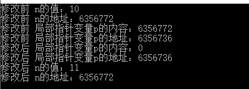
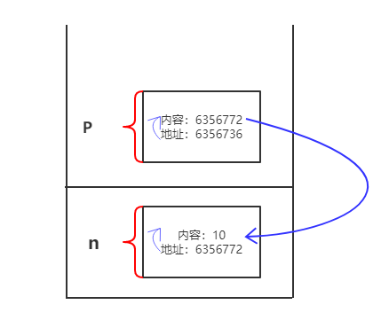
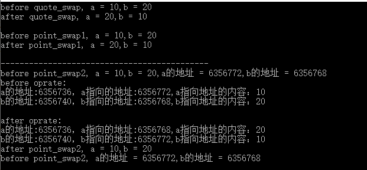
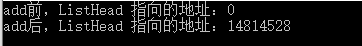
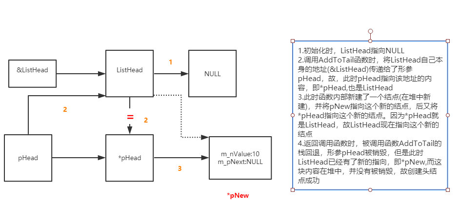
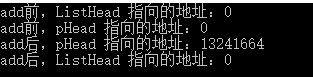
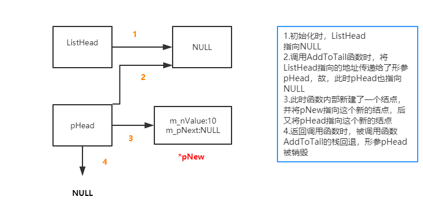

## 1.在C++中，有哪4个与类型转换相关的关键字


## 2.左值右值

### 定义

**左值(Lvalue)**：Location-value，表示可寻址。是保存在内存中，具有确切地址，并能取地址，进行访问，修改等操作的表达式。严格来说，这里定义的左值是pLvalue，也就是pure纯左值。

**右值(Rvalue)**：Read-value，表示可读不可寻址。是保存在内存中，或者寄存器中，不知道也无法获得其确切地址，在得到计算表达式结果后就销毁的临时表达式。严格来说，这里定义的右值是pRvalue，也就是pure纯右值。

**右值引用(Xvalue)**：Expiring value，表示即将过期但还没过期的值。与纯右值和纯左值不同，C++11新出了对右值的引用，取决于如何使用，这种引用既可能是右值，也可能是左值，需要单独考虑。

### 例子

1.左值

```c++
int var;
var = 4;
```

赋值运算符要求一个lvalue作为它的左操作数，当然var是一个左值，因为它是一个占确定内存空间的对象


2.非法赋值

```
4 = var;        //ERROR!
(var + 10) = 4; //ERROR!
```

常量`4`和表达式`var+1`都不是lvalue(它们是rvalue)。它们不是lvalue，因为都是表达式的临时结果，没有确定的内存空间（换句话说，它们只是计算的周期驻留在临时的寄存器中）。因此给它们赋值没有语意-这里没有地方给它们赋值。 


3.左值不一定可以修改，常量就是不可修改的，但是它有确定的地址，所以仍然是左值

```
int const a = 2;//a是左值，但是a不可以修改
```


**4.函数的返回值一般是右值，但也可以是左值**

```
int foo() { return 2; }

int main()
{
    foo() = 2;
    return 0;
}
```

你会得到：

```
test.c: In function 'main':
test.c:8:5: error: lvalue required as left operand of assignment
```

`foo`返回一个临时的rvalue。尝试给它赋值，`foo()=2`，是一个错误(即用了右值给右值赋值)；编译器期待在赋值运算符的左部分看到一个lvalue。 
不是所有的**对函数调用结果赋值**都是无效的。比如，C++的**引用**（reference）让这成为可能：

```
int globalvar = 20;

int& foo()
{
    return globalvar;
}

int main()
{
    foo() = 10;
    return 0;
}
```

这里`foo`返回一个引用，一个引用指向一个已经存在的内存位置（这里是`global`变量），所以这是一个左值，所以它可以被赋值。实际上，C++从函数中返回左值的能力对于实现一些**重载运算符**时很重要的。一个普遍的例子是在类中为实现某种查找访问而重载中括号运算符 []。`std::map`可以这样做。

```
std::map<int, float> mymap;
mymap[10]=5.6;12
```

给 mymap[10] 赋值是合法的因为非const的重载运算符 std::map::operator[] 返回一个可以被赋值的引用。


5.左值显然可以转换成右值，右值不能转化为左值，但是可以在其销毁前，作为参数转化为左值

```
//左值转换为右值
int a = 1;//a是左值
int b = 2;//b是左值
int c = a + b; //这里a和b从左值转换为右值，然后将和（右值）赋值给左值c。

//通过右值获得左值
int array[2] = {1,2}; //array是一个左值
*(array + 1) = 3;//array+1在计算过程中由左值转换为一个临时右值
//该右值被解引用，又从右值转换为一个左值。
```


6. 左值引用一般不能用右值初始化，因为如果用右值初始化，相当于将左值绑定在了右值上，那右值就不会被销毁，也就不是右值了（此时编译器通常会提示非常量引用的初始值只能为左值）。但是常量引用显然可以赋右值，因为常量引用不会改变引用的值。

```
int &a = 1;//错误，1是右值，a是左值引用，无法直接初始化
int a = 1; //正确，a是左值不是左值引用，可以被赋值
int const &a = 1;//正确，a是常量左值引用，可以链到右值上
```


## 3.二级指针

指向指针的指针即为二级指针

假设有一个 int 类型的变量 a，p1是指向 a 的指针变量，p2 又是指向 p1 的指针变量，它们的关系如下图所示：


将这种关系转换为C语言代码：

```
int a =100;int *p1 = &a;int **p2 = &p1;
```

指针变量也是一种变量，也会占用存储空间，也可以使用`&`获取它的地址。C语言不限制指针的级数，每增加一级指针，在定义指针变量时就得增加一个星号`*`。p1 是一级指针，指向普通类型的数据，定义时有一个`*`；p2 是二级指针，指向一级指针 p1，定义时有两个`*`。


### 值传递，指针传递，引用传递

形参：即形式参数，声明函数时的参数为形参

实参：即实际参数，调用函数时由主调函数传递给被调函数的真正有值的参数为实参

**值传递**：值传递过程中，被调函数的形式参数作为被调函数的局部变量处理，会在栈中开辟内存空间以存放由主调函数传递进来的实参值，即被调函数会将实参拷贝一份存放于栈中，从而形成了实参的一个副本。在未对形参做任何修改之前，形参和实参的值表面上一样，然而被调函数对形式参数的任何操作都是作为局部变量进行的，一旦形参发生改变，不会影响实参变量的值。（现在本质上形参和实参已经是不同的变量，相互独立，互不影响）。

**指针传递**：指针参数传递本质上是值传递，只是它所传递的是一个指针变量所指向的地址值，被调函数会将这个地址值拷贝一份放到栈中，在被调函数内可以修改地址值所对应的内容，但是不能修改指针变量本身(因为指针变量自己有另外的地址)。

举个例子：

```
#include <stdio.h>
using namespace std;

void point_test(int* p)
{
   printf("修改前 局部指针p指向的地址：%d\n",p);  //6356772
   printf("修改前 存储局部指针变量p的地址：%d\n",&p); //6356736
   *p = *p +1 ;
   p = NULL;
   printf("修改后 局部指针p指向的地址：%d\n",p);  //0
   printf("修改后 存储局部指针变量p的地址：%d\n",&p); //6356736
}

int main(){
      int n = 10;
      printf("修改前 n的值：%d\n",n);       //10
      printf("修改前 n的地址：%d\n",&n);    //6356772
      point_test(&n);
      printf("修改后 n的值：%d\n",n);       //11
      printf("修改后 n的地址：%d\n",&n);    //6356772
      return 0;
}
```



可以看到，修改前后传入函数的实参n的地址都不变，在函数内部，指针变量的内容即是传入的实参的地址值，对此地址值的内容修改，即会相应的作用到实参，相当于此时形参和实参都指向同一个地址。但是可以看到存放指针变量p的地址值是另外一个值，当我们令p = NULL时，指针变量里存放的地址值变为0，存放其本身的地址值不变。函数调用完成，栈回退，回到主调函数main函数时，n的地址也不变，因为我们从来没有修改过存储n的地址。



**引用传递**：引用参数传递过程中，被调函数的形式参数也作为局部变量在栈中开辟了内存空间，但是这时存放的是由主调函数放进来的实参变量的地址。被调函数对形参（本体）的任何操作都被处理成间接寻址，即通过栈中存放的地址访问主调函数中的实参变量（根据别名找到主调函数中的本体）。因此，被调函数对形参的任何操作都会影响主调函数中的实参变量。


### 区分引用传递和指针传递

```
#include <stdio.h>
using namespace std;

/*
  指针传递，交换的是指针指向的地址里的内容，所以能正确交换
*/
void point_swap1(int* a,int* b)
{
    int p = *a;
    *a = *b;
    *b = p;
}

/*
    实际上 point_swap2 交换的是形参（实参的拷贝）即两个指针变量指向的地址
    但是当函数调用返回时，栈回退，形参变量被销毁。传入的实参a,b并没有发生过任何改变，
    所以此函数不能正确交换a,b
*/
void point_swap2(int* a,int* b)
{
    printf("before oprate:\n");
    printf("a的地址:%d，a指向的地址:%d,a指向地址的内容：%d\n",&a,a,*a);
    printf("b的地址:%d，b指向的地址:%d,b指向地址的内容：%d\n",&b,b,*b);
    int *p = a;
    a = b;
    b = p;
    printf("\nafter oprate:\n");
    printf("a的地址:%d，a指向的地址:%d,a指向地址的内容：%d\n",&a,a,*a);
    printf("b的地址:%d，b指向的地址:%d,b指向地址的内容：%d\n",&b,b,*b);
}

/*  引用传递 */
void quote_swap(int& a,int& b)
{
   int p = a;
   a = b;
   b = p;
}

int main(){
     int a = 10,b = 20;
      printf("before quote_swap, a = %d,b = %d\n",a,b);
      quote_swap(a,b);
      printf("after quote_swap, a = %d,b = %d\n",a,b);
      printf("\n");

      a = 10,b = 20;
      printf("before point_swap1, a = %d,b = %d\n",a,b);
      point_swap1(&a,&b);
      printf("after point_swap1, a = %d,b = %d\n",a,b);
      printf("\n");

      printf("--------------------------------------------\n");

      a = 10,b = 20;
      printf("before point_swap2, a = %d,b = %d,",a,b);
      printf("a的地址 = %d,b的地址 = %d\n",&a,&b);
      point_swap2(&a,&b);
      printf("after point_swap2, a = %d,b = %d\n",a,b);
      printf("before point_swap2, a的地址 = %d,b的地址 = %d\n",&a,&b);

      return 0;
}
```




### 链表

《剑指offer》p49

```
#include <stdio.h>
using namespace std;

struct ListNode
{
    int  m_nValue;
    ListNode* m_pNext;
};

/*   向链表末尾插入新的结点 */
void AddToTail(ListNode** pHead,int value)
{
    ListNode* pNew = new ListNode();
    pNew->m_nValue = value;
    pNew->m_pNext = NULL;

    if(*pHead == NULL)
    {
        *pHead = pNew;
    }else
    {
        ListNode* p =  *pHead;
        while(p->m_pNext != NULL){
            p = p->m_pNext;
        }
        p->m_pNext = pNew;
    }
}

int main(){
     ListNode* ListHead = NULL;
     printf("add前，ListHead 指向的地址：%d\n",ListHead);  //0 
     AddToTail(&ListHead,10);
     printf("add后，ListHead 指向的地址：%d\n",ListHead);  // 10096963
     return 0;
}
```



需要特别注意的是AddToTail的第一个参数是二级指针（即指向指针的指针）。当我们往一个空链表中插入一个结点时，新插入的结点就会变成链表的头指针。由于此时会改动头指针，因此必须把pHead参数设置为二级指针，否则出了这个函数ListHead仍然时一个空指针。



**如果把pHead参数设置为一级指针**

```
void AddToTail(ListNode* pHead,int value)
{
    printf("add前，pHead 指向的地址：%d\n",pHead);
    ListNode* pNew = new ListNode();
    pNew->m_nValue = value;
    pNew->m_pNext = NULL;

    if(pHead == NULL)
    {
        pHead = pNew;
    }else
    {
        ListNode* p =  pHead;
        while(p->m_pNext != NULL){
            p = p->m_pNext;
        }
        p->m_pNext = pNew;
    }
     printf("add后，pHead 指向的地址：%d\n",pHead);
}
```



如图，最后返回调用函数时，ListHead仍然指向NULL




## 2.3.2  链表

### 面试题5：从尾到头打印链表

> 题目：输入一个链表的头结点，从尾到头返过来打印出每个结点的值

```
链表结构定义
struct ListNode
{
	int m_nKey;
	ListNode* m_pNext;
};
```

分析：链表遍历的正常顺序是从头到尾，可是题目要求从尾到头，也就是说第一个遍历到的结点最后一个输出，而最后遍历到的结点第一个输出。这就是典型的“后进先出”的例子，我们可以用`栈`实现这种顺序。另外，既然想到了用栈来实现这个函数，而`递归`在本质上就是一个栈结构（操作系统级别，对程序员不可见），于是自然也可以用递归来实现。

```
#include <stdio.h>
#include<stack>
using namespace std;

struct ListNode
{
	int m_nValue;
	ListNode* m_pNext;
};

void AddToTail(ListNode** pHead,int value)
{
    ListNode* pNew = new ListNode();
    pNew->m_nValue = value;
    pNew->m_pNext = NULL;

    if(*pHead == NULL)
    {
        *pHead = pNew;
    }else
    {
        ListNode* p =  *pHead;
        while(p->m_pNext != NULL){
            p = p->m_pNext;
        }
        p->m_pNext = pNew;
    }
}

/*
    利用栈结构迭代逆序输出链表元素
*/
void PrintListReveringly_Iteratively(ListNode* pHead)
{
    ListNode* p = pHead;
    stack<ListNode*> nodesStack;
    while(p!=NULL){
        nodesStack.push(p);
        p = p->m_pNext;
    }
    while(!nodesStack.empty()){
        printf("%d ",nodesStack.top()->m_nValue);
        nodesStack.pop();
    }
}
/*
    利用递归逆序输出链表元素（隐式的栈）
*/
void PrintListReveringly_Recursively(ListNode* pHead)
{
    if(pHead == NULL)
        return;
    PrintListReveringly_Recursively(pHead->m_pNext);
    printf("%d ",pHead->m_nValue);
}

int main(){
     ListNode* ListHead = NULL;
     AddToTail(&ListHead,1);
     AddToTail(&ListHead,2);
     AddToTail(&ListHead,3);
     AddToTail(&ListHead,4);
     AddToTail(&ListHead,5);

     printf("使用栈输出结果：\n");
     PrintListReveringly_Iteratively(ListHead);

     printf("\n 使用递归输出结果：\n");
     PrintListReveringly_Recursively(ListHead);

     return 0;
}
```


## 2.3.4 树