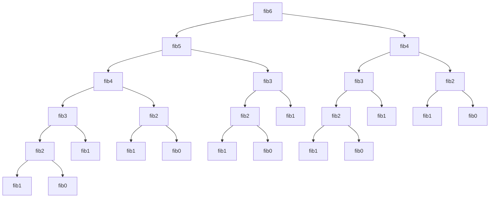
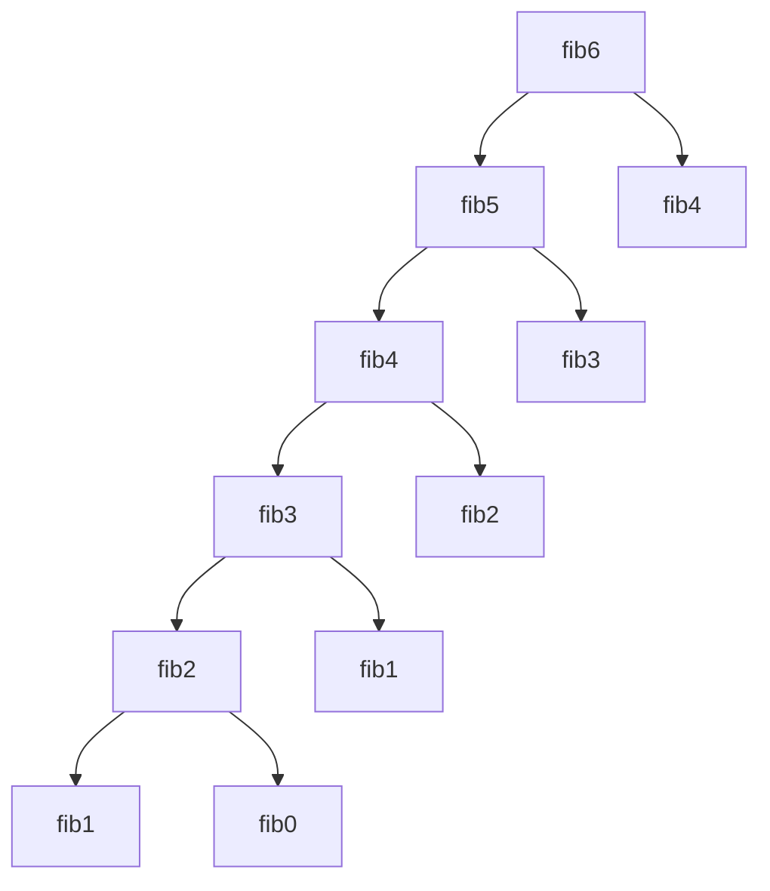
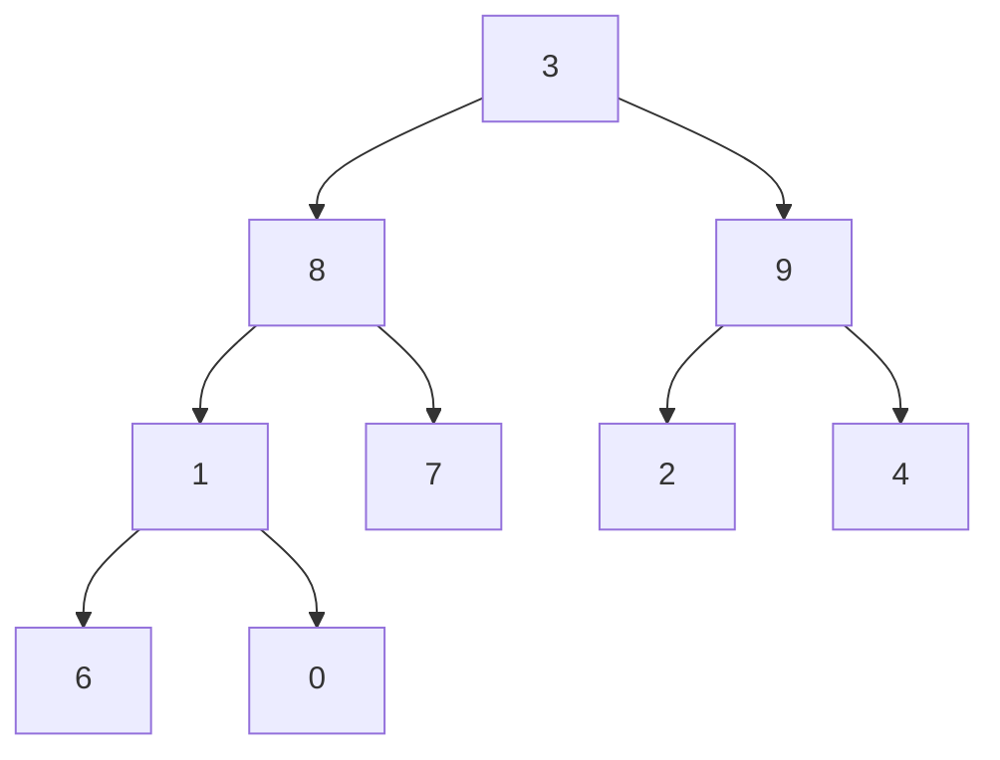
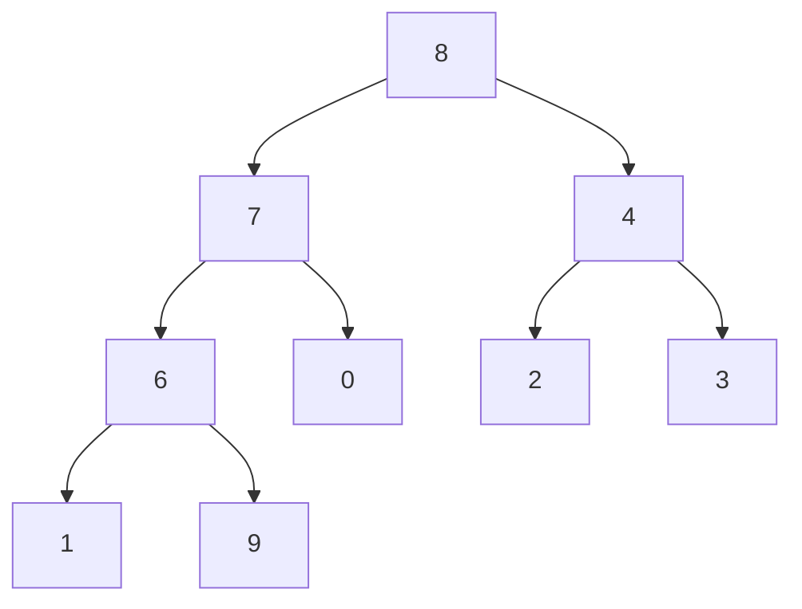

## 【Fibonacci数列】 斐波那契数列

> 本文均是本人一个一个字打出来的，没有复制粘贴别人的东西，手打的东西也没有直接抄书或者抄别人的内容，都是看过之后用自己的话重新书写出来的。代码也都是自己写的，经过测试的。


全文目录：

[TOC]

### Fibonacci数列定义

Fibonacci数列的通常定义

**定义一：**
$$
fib(n)=
\begin{cases} 
n\quad\quad\quad\quad\quad\quad\quad\quad\quad\quad\quad\quad(若n<=1)\\ 
fib(n-1)+fib(n-2)\quad\quad\quad(若n>=2)
\end{cases}
$$
由这个定义，可以得到

| 下标n  | 0    | 1    | 2    | 3    | 4    | 5    | 6    | 7    | 8    | 9    | .......  |
| ------ | ---- | ---- | ---- | ---- | ---- | ---- | ---- | ---- | ---- | ---- | -------- |
| fib(n) | 0    | 1    | 1    | 2    | 3    | 5    | 8    | 13   | 21   | 34   | ........ |

即：fib(0) = 0, fib(1) = 1, fib(2) = 1, fib(3) = 2    ............


在另外一些书上，Fibonacci数列是这样定义的

**定义二：**
$$
fib(n)=
\begin{cases} 
1\quad\quad\quad\quad\quad\quad\quad\quad\quad\quad\quad\quad(若n=0,1)\\ 
fib(n-1)+fib(n-2)\quad\quad\quad(若n>=2)
\end{cases}
$$


同样由这个定义，可以得到

| 下标n  | 0    | 1    | 2    | 3    | 4    | 5    | 6    | 7    | 8    | 9    | .......  |
| ------ | ---- | ---- | ---- | ---- | ---- | ---- | ---- | ---- | ---- | ---- | -------- |
| fib(n) | 1    | 1    | 2    | 3    | 5    | 8    | 13   | 21   | 34   | 55   | ........ |

定义二和定义一对  f(0)的初始值不一样，定义一中 f(0) = 0,定义二中f(0) = 1,所以定义一相比定义二要推迟1个单位。但是作为Fabonacci它们基本的核心定义是一样的也即 fib(n) = fib(n-1) + fib(n-2)


------


下面都是基于【 定义一】 来做的讨论，保持与邓俊辉版本的《数据结构》一致

### **二分递归**

根据定义可以知道，Fibonacci数列实际上是一个递归定义，要计算f(n)就要知道f(n-1)和f(n-2)，要计算f(n-1),就要知道f(n-2)和f(n-3)，以此类推，而边界就是我们一开始给定的  fib(0) = 0, fib(1) = 1,

以fib(6)为例，下面是计算fib(6)展开的递归树




由此可以得到计算Fibonacci数的递归代码：

```
int fib(int n)
{
	if(2 > n)
       return n;   //递归基
     else
        return fib(n-1) + fib(n-2);    //递推公式
}
```

这是一个二分递归，从n开始，计算每一个fib(n)时都要分支为两个计算，故 ==时间复杂度为 O（2^n）==。

空间复杂度线性正比于递归深度，故这里的==空间复杂度为O（n）==

二分递归在计算过程中所出现的递归实例的重复度极高，如上面计算fib6时，fib4重复出现了2次，fib3重复出现了3次，fib2重复出现了5次，这是致使二分递归时间复杂度达到指数级别的真正原因所在。


### **——更多优化**


#### **1.线性递归**

线性递归版本一：

Fibonacci数在计算过程中每一步并不是相互独立的，可以用到上一次的计算结果。那么考虑把中间先计算出的结果保存下来，如果当再次需要这个结果的时候先检查是否已经得到了。

```
int dp[MAXN];   //dp[n] 表示 fib(n)的结果
fill(dp,dp+MAXN,-1); //初始化dp[]的每个值为-1，dp[n] = -1表示F(n)当前还没有被计算过
int fibL(int n)
{
   if(2 > n)
      return n;
      
   if(dp[n] != -1)
   {
   	   return dp[n];
   }
    else
    {
    	dp[n] = fibL(n-1) + fibL(n-2);
        return dp[n];
    }
}
//《算法笔记》上的版本
```

这个版本的fibonacci数计算也用到了动态规划思想的方法，也即是在计算过程中记录子问题的解，来避免下次遇到相同的子问题时重复计算。这也称之为记忆搜索==时间复杂度和空间复杂度均为O(n)==

与二分递归的递归计算图相比，下面是Fibonacci数列记忆搜索示意图



​															图：Fibonacci数列记忆搜索示意图


线性递归版本二：

        ```
/*
函数说明：
prev作为辅助变量记录前一项，当前函数返回的是数列当前项
*/
int fibL(int n,int& prev)
{
	//递归基，直接取值
	if(0 == n)
	{
		prev = 1; //相当于初始 fib(-1) = 1 
		return 0;  // fib(0) = 1
	}
	else //深入递归计算
	{
		int prePrev;
		prev = fibL(n-1,prePrev);//递归计算前两项
		return prevPrev + prev;//其和即为正解
	}
}
//邓俊辉《数据结构》上的版本

/*
使用例子：
int prev;
fibL(6,prev);
结果：
fibL(6,prev) = 8;
prev = 5;
*/
        ```

这个版本稍微难理解点，主要是借助一个参数引用来一直记录前一项的值 。

和 fib(n) = fib(n-1) + fib(n-2) 相比，这里省略了 fib(n-2),而实际上  fib(n-2)的解答在这里借助了形式参数的机制，通过变量 prevPrev “调阅” 此前的记录直接获得。

==时间复杂度和空间复杂度均为O(n)==


#### **2.迭代（动态规划的思想）**

​      如果从 1->n  计算  fib（n）

​        fib0  +  fib1 = fib2   —>   fib1 +fib2 = fib3   —>     fib2 + fib3 = fib4    —>     fib3 + fib4 = fib5     .............

 由此可以得到迭代版代码：

```
int fibI(n)
{
	int f = 1,g =0; //相当于fib(-1) = 1,fib(0) = 0;
	while(n--)
	{
		g = g + f;  //g 变为g与f的和,也即g往前进一步
		f = g - f;  // f变为g,也即f往前进一步
	}
	return g;
}
```

不难得出==时间复杂度为O(n)，空间复杂度为 O(1)==


#### **3.快速幂矩阵求斐波那契数列**

还有一种更快的方法求斐波那契数列的方法，==时间复杂度仅为：O( logn )==，就是马上要介绍的斐波那契数列的快速幂矩阵方法

首先，由矩阵乘法，我们知道下式成立
$$
\begin{pmatrix}
\mathbf{0} & \mathbf{1}  \\
\mathbf{1} & \mathbf{1}  \\
\end{pmatrix}
\times
\begin{pmatrix}
\mathbf{fib(k-1)}   \\
\mathbf{fib(k)}  \\
\end{pmatrix}
=
\begin{pmatrix}
\mathbf{fib(k)}   \\
\mathbf{fib(k-1)+fib(k)}  \\
\end{pmatrix}
=
\begin{pmatrix}
\mathbf{fib(k)}   \\
\mathbf{fib(k+1)}  \\
\end{pmatrix}
$$
也即
$$
\begin{pmatrix}
\mathbf{fib(k)}   \\
\mathbf{fib(k+1)}  \\
\end{pmatrix}
=
\begin{pmatrix}
\mathbf{0} & \mathbf{1}  \\
\mathbf{1} & \mathbf{1}  \\
\end{pmatrix}
\times
\begin{pmatrix}
\mathbf{fib(k-1)}   \\
\mathbf{fib(k)}  \\
\end{pmatrix}
$$


由此，可以进一步推导如下通项公式：
$$
\begin{pmatrix}
\mathbf{fib(n)}   \\
\mathbf{fib(n+1)}  \\
\end{pmatrix}
=
\begin{pmatrix}
\mathbf{0} & \mathbf{1}  \\
\mathbf{1} & \mathbf{1}  \\
\end{pmatrix}
^n
\times
\begin{pmatrix}
\mathbf{fib(0)}   \\
\mathbf{fib(1)}  \\
\end{pmatrix}
=
\begin{pmatrix}
\mathbf{0} & \mathbf{1}  \\
\mathbf{1} & \mathbf{1}  \\
\end{pmatrix}
^n
\times
\begin{pmatrix}
\mathbf{0}   \\
\mathbf{1}  \\
\end{pmatrix}
$$

$$
设：
\begin{pmatrix}
\mathbf{0} & \mathbf{1}  \\
\mathbf{1} & \mathbf{1}  \\
\end{pmatrix}
^n 
=
\begin{pmatrix}
\mathbf{a} & \mathbf{b}  \\
\mathbf{c} & \mathbf{d}  \\
\end{pmatrix}
，
则 
\begin{pmatrix} 
\mathbf{fib(n)}   \\
\mathbf{fib(n+1)}  \\ 
\end{pmatrix}
=
\begin{pmatrix}
\mathbf{a} & \mathbf{b}  \\
\mathbf{c} & \mathbf{d}  \\
\end{pmatrix}
\times
\begin{pmatrix}
\mathbf{0}   \\
\mathbf{1}  \\
\end{pmatrix}
=
\begin{pmatrix}
\mathbf{b}   \\
\mathbf{d}  \\
\end{pmatrix} 
$$
由此可以得到 fib(n) = b,  fib(n+1) = d, 


其中
$$
\begin{pmatrix}
\mathbf{0} & \mathbf{1}  \\
\mathbf{1} & \mathbf{1}  \\
\end{pmatrix}
^n 
\quad,矩阵乘法的计算，可以套用快速幂的算法流程,快速幂的时间复杂度仅为O(logn)
$$


将普通数的两个数的乘法运算换成两个矩阵的乘法运算，即可实现 fib(n) 的计算。更重要的是。这里仅涉及 

2 × 2 的矩阵的计算，每次同样只需要常数的时间，故==整体的运行时间也是 O ( logn )==

 

**矩阵乘法**
$$
\begin{pmatrix}
\mathbf{a}_{11} & \mathbf{a}_{12}  \\
\mathbf{a}_{21} & \mathbf{a}_{22}  \\
\end{pmatrix}
\times
\begin{pmatrix}
\mathbf{b}_{11} & \mathbf{b}_{12}  \\
\mathbf{b}_{21} & \mathbf{b}_{22}  \\
\end{pmatrix}
=
\begin{pmatrix}
\mathbf{a}_{11}\times{b}_{11}+{a}_{12}\times{b}_{21}& 
\mathbf{a}_{11}\times{b}_{12}+{a}_{12}\times{b}_{22}  \\
\mathbf{a}_{21}\times{b}_{11}+{a}_{22}\times{b}_{21} & 
\mathbf{a}_{21}\times{b}_{12}+{a}_{22}\times{b}_{22}  \\
\end{pmatrix}
$$


示例代码：

```
#include<iostream>
#include<stdio.h>
#include<string.h>
using namespace std;

//  2*2 的矩阵 
struct mat{
    int res[2][2];
    //构造函数 
    mat()
    {
        memset(res,0,sizeof(res));
    }
    //构造函数 
    mat(int a00,int a01,int a10,int a11)
    {
        res[0][0] = a00;
        res[0][1] = a01;
        res[1][0] = a10;
        res[1][1] = a11;
    }
    //深度拷贝方法 
    mat operator=(const mat& a)
    {
        for(int i=0;i<2;i++)
            for(int j=0;j<2;j++)
                res[i][j] = a.res[i][j];
        return *this;
    }
};

/*
  矩阵乘法,n维矩阵的相乘 
*/ 
mat multi(mat a,mat b,int n)
{
    mat c;
    for(int i=0;i<n;i++)//行
    {
        for(int j=0;j<n;j++)//列
        {
            for(int k=0;k<n;k++)//枚举个数
            {
                c.res[i][j]=(c.res[i][j]+a.res[i][k]*b.res[k][j]);
            }
        }
    }
    return c;
}

/*
   矩阵乘法快速幂
  ( 0 1 ) ^n
  ( 1 1 )
*/
mat matirix_pow(mat a,int n)
{
    mat pow(1,0,0,1);//单位矩阵，相当于1
    mat p = a;
    while(0 < n)
    {
        if(n&1)
            pow = multi(pow,p,2);    // pow = pow*p
        p = multi(p,p,2);   // p = p*p
        n >>= 1;   //  n = n/2
    }
    return pow;
}

/*
	用快速矩阵乘法求fibonacci数列 
	  fib(n) =  fibMat.res[0][1];
	fib(n+1) =  fibMat.res[1][1];
*/ 
int fib_matrixPow(int n)
{
	mat a(0,1,1,1);
	mat fibMat = matirix_pow(a,n);
	return fibMat.res[0][1];
} 

int main()
{
	cout<<"fib(9) = "<<fib_matrixPow(9)<<endl;
    return 0;
}
```


## 【快速幂】

快速幂就是快速算出底数的n次幂，它的复杂度为log(n),相比朴素的O(n)有了极大的提高，故因此得名

### 蛮力算法

以求 2^n^ 为例，最直接的办法就是将n个2相乘，即： 
$$
2 \times 2 \times2 \times2 \times2 \times.........{有n个2} = 2^n
$$
时间复杂度为 O(log)

```
#include<iostream>
using namespace std;

// 蛮力算法递归版 
int pow2_brute_recursive(int n)
{
	if( n == 0)
		return 1;
	return 2*pow2_brute_recursive(n-1);
	
}
// 蛮力算法迭代版 
int pow2_brute_iteration(int n)
{
	int res = 1;
	while(n--){
		res *= 2;
	}
	return res;
}

int main()
{
	cout<<"pow2_brute_recursive(8) = "<<pow2_brute_recursive(8)<<endl;
	cout<<"pow2_brute_iteration(8) = "<<pow2_brute_iteration(8)<<endl;
    return 0;
}
```


### 快速幂相乘

#### 原理：

$$
pow2(n)=
\begin{cases} 
n\quad\quad\quad\quad\quad\quad\quad\quad\quad\quad\quad\quad(若n<=1)\\ 
pow2(\lfloor n/2 \rfloor)^2\times2 \quad\quad\quad\quad\quad(n>0\quad and\quad odd)\\ 
pow2(\lfloor n/2 \rfloor)^2\quad\quad\quad\quad\quad\quad\quad(n>0\quad and\quad even)
\end{cases}
$$


```
#include<iostream>
using namespace std;

/*
      快速幂，时间复杂度O(logn)
      求 2^n
*/
int square(int n)
{
    return n*n;
}
//递归版本
int pow2_recursive(int n)
{
    if(n==0)
        return 1;
    return (n&1)?square(pow2_recursive(n>>1))<<1
                 :square(pow2_recursive(n>>1));
}
//迭代版本
int pow2_iteration(int n)
{
    int pow = 1;
    int p=2;
    while(0 < n)
    {
       if(n&1)
         pow *=p;
      p *= p;
      n >>= 1;
    }
    return pow;
}

/*
    快速幂迭代版，时间复杂度O(logn)
    求 a^n
*/
int pow(int a,int n)
{
    int pow = 1;
    int p = a;
    while(0 < n)
    {
        if(n&1)
          pow *= p;
        p *= p;
        n >>= 1;
    }
    return pow;
}


int main()
{
   cout<<"pow2_recursive(5): "<<pow2_recursive(5)<<endl;
   cout<<"pow_iteration(5): "<<pow_iteration(5)<<endl;
   cout<<"pow(5,3): "<<pow(5,3)<<endl;

    return 0;
}
```


## 【栈及其应用】

栈是一种“**后进先出**”线性序列结构，和数组这种同是线性序列的结构相比，栈的一端被“封”住，元素进入和出去都只允许从某一端。

### STL 里的栈

```
#include<stack>  //要使用STL里的栈就要先引入这个头文件

template<typename T>
stack<T> sta;   //声明各种类型的栈,除了C++内置的基本类型，栈的元素也可以是自定义的结构体
具体如：
stack<int> sta;
stack<double> sta;
stack<char> sta;
stack<string> sta;
..........

stack<int> sta;
sta.push(1);  //往栈中放入一个元素,新元素成为新的栈顶元素
sta.pop();  //从栈顶弹出一个元素
sta.top();  //返回当前栈顶元素
sta.empty(); //判断栈是否为空
sta.size();  //查看当前栈中有几个元素
```


### 栈的应用

#### 1.逆序输出  —  进制转换

十进制转其他进制

如：  121~（10）~    =   1111000~(2)~

​          12345 ~(10)~   =  30071~(8)~

其他进制转十进制

如：      1111001~(2)~   =  1*2^0^ + 0 * 2^1^ + 0 * 2^2^  + 1 * 2^3^  + 1 * 2^4^ + 1 * 2^5^ + 1 * 2^6^  =  121

​                  30071~(8)~   =   1*8^0^ + 7 * 8^1^ + 0 * 8^2^  + 0 * 8^3^  + 3 * 8^4^  =  12345

推广：    任何  k 进制的数b~n~ b~n-1~ .....b~3~ b~2~ b~1~ b~0~转为十进制数

​                b~n~ b~n-1~ .....b~3~ b~2~ b~1~ b~0~   =    b~0~*k^0^ + b~1~ * k^1^ +  b~2~  * k^2^  + b~3~ * k^3^  +  .......+  b~n-1~ * k^n-1^   + b~n~ * k^n^  

十进制与其他进制相互转换示例代码如下：

```
#include<iostream>
#include<stdio.h>
#include<stack>
using namespace std;

//把十进制数转为base进制
stack<int> dCovert(int n,int base)
{
    stack<int> sta;
    while(n > 0)
    {
        sta.push(n%base);
        n /= base;
    }
    return sta;
}

//将base进制的数转为十进制数
int covertD(stack<int> sta,int base)
{
    int n = 0;
    int i;
    while(!sta.empty())
    {
        n = n*base + sta.top();
        sta.pop();
    }
    return n;
}

int main()
{
    stack<int> sta;
    sta = dCovert(120,2);
    stack<int> sta_cp = sta;
    cout<<"十进制转二进制：";
    while(!sta.empty())
    {
       cout<<sta.top();
       sta.pop();
    }
    cout<<endl;
    cout<<"二进制转十进制："<<covertD(sta_cp,2)<<endl;
    return 0;
}
```


#### 2.递归嵌套 — 栈混洗，括号匹配

##### 栈混洗

栈混洗：存在3个栈 A，B，S，其中只有栈 A 不为空，栈 B 和栈 S 都为空，现在通过某种次序将栈 A中的元素push到 B 中 ，再从 B 中push到S中，最终通过有限次的倒腾（也就是3个栈的push，pop操作），使得最后A,B栈为空，S栈不为空。我们通常称这样一个过程之为栈混洗。

先来看一个栈混洗的题目：

现有3个栈A、B、S，其中A中的元素为 [ 1 2 3 4 >  , 将A中的元素以某种次序出栈，S作为临时放的栈，最终A中元素要push到B中，请问下列哪种不可能是最终B中元素次序    （注： 符号 [ 表示栈底，> 表示栈顶）

a.  [ 1 2 3 4 >      b.  [4 3 2 1 >     c. [ 3 2 1 4 >       d. [ 2 1 4 3>

解答： a , b, c 答案都是    [ 1 2 3 4 > 可能的栈混洗；d 不可能，因为 2 1 最后位于栈底，那么 4 3 是先出栈放到临时栈S中的，即   [  4 3 > ,  从S中出栈入到B中只能是先出3，B变为[ 2 1  3 >，再出4，B变为[ 2 1  3 4 >，所以不可能是 [ 2 1 4 3>


##### 括号匹配

检查某一表达式或字符串中的括号是否匹配

如：

​			（（ 0 + （1 + 23）/4 * 5 * 67 - 8 + 9  )） 

​			 {  (  [   ]   ) } (  )

方法：从前往后扫描字符串，遇到左括号先压入栈，遇到右括号就将栈顶元素弹出，看是否与当前扫描的右括号相匹配，匹配就继续扫描，直到扫描结束，所有压入栈中的左括号都找到与之匹配的右括号而并被弹出，栈为空。否则中间任有一次不匹配都认为整个字符串括号不匹配。

括号匹配示例代码：

```
#include<stdio.h>
#include<stack>

using namespace std;
/*
	检查括号是否匹配
*/
bool braketMatch(char str[])
{
    stack<char> sta;
    char* p = str;
    while(*p != '\0')
    {
        switch(*p)
        {
           case '(':
               sta.push(*p);
            break;
            case '[':
               sta.push(*p);
            break;
            case '{':
               sta.push(*p);
            break;
            case ')':
               if(sta.top() != '(')
                  return false;  //有一次不匹配直接返回false,退出
               sta.pop();  //否则弹出当前左括号，准备进行下一轮匹配检查或者检查已结束
            break;
            case ']':
               if(sta.top() != '[')
                  return false;
               sta.pop();
            break;
            case '}':
               if(sta.top() != '{')
                  return false;
               sta.pop();
            break;
        }
        p++;
    }
    if(!sta.empty())//最后还要判断栈是否为空，不为空则有左括号没有找到匹配，则判定字符串不匹配
        return false;
    return true;//经过了层层考验终于来到这里
}

int main()
{
	char* str1 = "{ [ ()} ()";
    char* str2 = "( ( 0 + ( 1 + 23 ) /4*5*67-8+9))";
    bool match1 = braketMatch(str1);
    bool match2 = braketMatch(str2);
    if(match1)
      printf("str1: %s is matching\n",str1);
    else
         printf("str1: %s is  not matching\n",str1);

    if(match2)
      printf("str2: %s is matching\n",str2);
    else
      printf("str2: %s is not matching\n",str2);

    return 0;
}
```


#### 3.延迟缓冲 —表达式求值

中缀表达式求值

如：

​			 30 / 90 - 26 + 97 - 5 - 6 - 13 / 88 * 6 + 51 / 29 + 79 * 87 + 57 * 92

​			（（ 0 + （1 + 23）/4 * 5 * 67 - 8 + 9  ) )

不能直接从左到右直接进行计算，因为后面可能存在高优先级的运算符要比前面低优先级的运算符先进行计算。所以一可以用栈作为缓存保存前面待运算的数值和运算符，等待该它们运算的时候再取出来运算。

逻辑：

1. 运算符之间存在优先级关系，通常要事先约定好，如 * / 比 + - 要先计算
2. 从前往后扫描中缀表达式，后面的运算符因为优先级比较高可能会先计算，所以前面某些数和低优先级的运算符要先缓存，等待后面的运算完之后才能运算。
3. 一般都是有了两个数，一个运算符之后可以计算一个结果，计算的结果又可以作为等待被计算的数。
4. 由以上分析可以考虑建立两个栈，一个存放数值，另一个存放运算符。从前往后扫描，遇到数的时候直接入操作数栈，而遇到运算符先与栈顶运算符进行比较，如果栈顶运算符优先级比较高，此时栈顶运算符可以取出来运算了，同时取出操作数栈里的两个操作数一起运算，将运算结果再次存入到操作数栈中。

细节：

1. 初始时，操作数栈和运算符栈均为空，第一个运算符怎么和栈顶运算符做比较？

   答：为了实现循环的自动化，统一算法的处理流程，这里不妨初始时将先 ‘\0’也当做一个运算符 ，人为设置其第一个入栈，将 ‘\0’ 的优先级设置为最低，也就是说其他任何运算符和它比较优先级都比它高从而入栈。其实可以把‘\0’看成一个哨兵，这个哨兵在遇到其他运算符时都让它们入栈，而当扫描到表达式末尾，遇到表达式结束标志字符‘\0’时结束表达式运算。

​    2.什么时候表达式运算结束？

​		答：可以考虑扫描到字符串末尾的时候结束。或是当运算符栈为空时结束运算，前面已经把 '\0' 放入栈中，正      		常的运算符都比它优先级高，所以它不能出栈，C语言字符串都是以‘\0’结束的，所以当扫描到结束的‘\0’字符  时，让此时栈内唯一剩下的‘\0’出栈，它的使命结束了，‘\0’被出栈了，栈就为空了，也即表达式运算结束。

3. 除了‘）’，‘\0’,每个运算符都要入栈，只有入栈了，当扫描到其他运算符和它进行比较时，才有出栈运算的机会


先建立一个运算符优先级表，可以快速的找到运算符之间的关系，也避免代码中使用复杂冗余的if语句，使得代码更直观简洁高效。

运算符优先级表：

```
/*
   操作符优先级比较表
*/
                 //当前运算符   +    -    *     /   (    )  '\0'
char pri[7][7] = {
           /* 栈  +  */    {'>', '>', '<', '<', '<', '>','>'},
           /* 顶 -   */    {'>', '>', '<', '<', '<', '>','>'},
           /* 运 *   */    {'>', '>', '>', '>', '<', '>','>'},
           /* 算 /   */    {'>', '>', '>', '>', '<', '>','>'},
           /* 符 (   */    {'<', '<', '<', '<', '<', '=',' '},
           /*    )   */    {' ', ' ', ' ', ' ', ' ', ' ',' '},
           /*   '\0' */    {'<', '<', '<', '<', '<', ' ','='}

这个表什么意思？
想要这样的效果 pri[‘+’][‘*’] = ‘<’,pri[‘*’][‘/’] = ‘>’等，即栈顶运算符和当前运算符比较得到的关系，比如'+’和‘*’的到<，那么当前扫描到的运算符压栈
经过不同表达式的分析，可以得到栈顶运算符和当前运算符存在三种关系：
   关系                    操作
   <             栈顶运算符优先级低于当前运算符，当前运算符压栈
   >             栈顶运算符优先级高于当前元素运算符，栈顶运算符和对应操作数出栈 
   =             栈顶运算符优先级等同于当前元素运算符，栈顶运算符出栈
   
但是字符不能作为下标，所以先建立一个字符和数字之间的对应关系
先对  +    -    *     /   (    )  '\0' 这6个符号和 0 1 2 3 4 5 建立一个映射关系
map<char,int> opMap;
//建立运算符和下标的关系
opMap.insert(make_pair('+',0));
opMap.insert(make_pair('-',1));
opMap.insert(make_pair('*',2));
opMap.insert(make_pair('/',3));
opMap.insert(make_pair('(',4));
opMap.insert(make_pair(')',5));
opMap.insert(make_pair('\0',6));

那么 pri[opMap['+']][opMap['+']]就可以得到 '>',同理pri[opMap['+']][opMap['*']] = ‘<’

```


步骤：

1. 读入表达式，预处理去掉空格（空格位于数字和符号之间）
2. 建立运算符优先级关系表
3. 扫描表达式，分析表达式中的数字和运算符，从表达式中提取出操作数和运算符，根据运算符的优先级关系分为几种情况： ‘<’ 运算符入栈,并继续扫描； '>' 取出栈顶运算符和操作数做运算； ‘=’ 取出栈顶运算符丢弃，并继续扫描。
4. 重复步骤3直至 运算符栈为空


示例代码：

> 测试数据：
>
> 30 / 90 - 26 + 97 - 5 - 6 - 13 / 88 * 6 + 51 / 29 + 79 * 87 + 57 * 92
>
> ( (  0 + ( 1 + 23 ) / 4 * 5 * 67 - 8 + 9  )  )


中缀表达式求值示例代码：

```
#include<iostream>
#include<stack>
#include<string.h>
#include<stdio.h>
#include<iomanip>
#include<map>
#include <sstream>
using namespace std;

/*
测试用例：
30 / 90 - 26 + 97 - 5 - 6 - 13 / 88 * 6 + 51 / 29 + 79 * 87 + 57 * 92
0
*/
const int NUMOP = 7;
/*
   操作符优先级比较表
*/
              //当前运算符   +    -    *     /   (    )  '\0'
char pri[NUMOP][NUMOP] = {
               /*  +   */    {'>', '>', '<', '<', '<', '>','>'},
               /*  -   */    {'>', '>', '<', '<', '<', '>','>'},
               /*  *   */    {'>', '>', '>', '>', '<', '>','>'},
               /*  /   */    {'>', '>', '>', '>', '<', '>','>'},
               /*  (   */    {'<', '<', '<', '<', '<', '=',' '},
               /*  )   */    {' ', ' ', ' ', ' ', ' ', ' ',' '},
               /* '\0' */    {'<', '<', '<', '<', '<', ' ','='}


                        };
map<char,int> opMap;
void createOpTable()
{
    //建立运算符和下标的关系
    opMap.insert(make_pair('+',0));
    opMap.insert(make_pair('-',1));
    opMap.insert(make_pair('*',2));
    opMap.insert(make_pair('/',3));
    opMap.insert(make_pair('(',4));
    opMap.insert(make_pair(')',5));
    opMap.insert(make_pair('\0',6));
}
/*
    判断当前的字符是操作符还是数，是数则返回true,否则返回false
    并且从字符串中提取数
*/
bool readNumber(char* &sp,double &number)
{
    char num_s[9] = {0};
    if(*sp >= '0' && *sp <= '9'){
        int i=0;
        while(*sp >= '0' && *sp <= '9')
        {
            num_s[i++] = *sp;
            sp++;
        }
        sscanf(num_s,"%lf",&number);
        return true;
    }else{
        return false;
    }
}

int main()
{
    createOpTable();
    string str;
    string RPN; //逆波兰表达式

    while(getline(cin,str) && str!="0"){

        stack<double> numberStack;
        stack<char> operatorStack;
        operatorStack.push('\0');

        //删除表达式str中的空格
        for(int i=0;i<str.length();i++)
        {
            if(str[i]==' '){
                str.erase(i,1);
            }
        }
     //   cout<<"after initial:"<<str<<endl;

        char stingstr[210]={0};
        //将string转为str[]数组
        str.copy(stingstr,210);
        //设置字符指针，用来遍历表达式
        char* sp = stingstr;

        while(!operatorStack.empty())
        {
             double number;
             char op;
             if(readNumber(sp,number))
             {
                numberStack.push(number);
                cout<<"number:"<<number<<endl;
                char ss[5];
                sprintf(ss,"%d",(int)number);
                string strnumber = ss;
                RPN += strnumber;//数字直接追加到RPN后
             }
             else
             {
                op = *sp;
                char stackOp = operatorStack.top();
                cout<<"stackOp:"<<stackOp<<"  cuOp:"<<op<<endl;
                char order = pri[opMap[stackOp]][opMap[op]];
                switch(order){
                case '<':
                    operatorStack.push(op);
                    sp++;
                    break;
                case '>':{
                     double numB = numberStack.top();
                     numberStack.pop();
                     double numA = numberStack.top();
                     numberStack.pop();
                     double numSum;
                     switch(stackOp){
                        case '+':
                             numSum = numA + numB;
                             printf("%f + %f = %f\n",numA,numB,numSum);
                        break;
                        case '-':
                             numSum = numA - numB;
                             printf("%f - %f = %f\n",numA,numB,numSum);
                        break;
                        case '*':
                             numSum = numA * numB;
                             printf("%f * %f = %f\n",numA,numB,numSum);
                        break;
                        case '/':
                             numSum = numA / numB;
                             printf("%f / %f = %f\n",numA,numB,numSum);
                        break;
                     }
                     numberStack.push(numSum);
                     operatorStack.pop();
                     RPN += stackOp;//运算符该计算的时候追加到RPN后
                  }
                  break;
                case '=':
                    operatorStack.pop();
                    sp++;
                    break;
                default:
                    break;
                }
             }
        }

        if(!numberStack.empty())
        {
            cout<<"final result: "<<endl;
            cout<<fixed << setprecision(2)<<numberStack.top()<<endl;
        }
        cout<<"逆波兰表达式 RPN："<<RPN<<endl;
    }
    return 0;
}
```


#### 4.逆波兰表达式RPN

将中缀表达式转为后缀表达式即为逆波兰表达式，RPN（Reversal Polish Notation）

如：

​			中缀表达式： 30 / 90 - 26 + 97 - 5 - 6 - 13 / 88 * 6 + 51 / 29 + 79 * 87 + 57 * 92

其对应逆波兰表达式： 30 90 /  26 - 97 + 5 - 6  -13 88 / 6 * - 51 29 / + 79 87 * + 57 92 * +

​		      中缀表达式：	（（ 0 + （1 + 23）/4 * 5 * 67 - 8 + 9  ) 

其对应逆波兰表达式： 0 1 23 + 4 / 5 * 67 * + 8 - 9 +

RPN干什么的，有什么用，为什么还要有RPN？

1. RPN的好处就是每一个运算符的紧紧跟在其操作数之后，而并不需要事先定义各种运算符的优先级，只需从头到尾的一趟扫描就可以完成计算，不像中缀表达式一样需要各种条件控制逻辑，从而大大加速了计算的速度。

2. RPN中操作数的顺序和原来的中缀表达式中的顺序是一致的

   

##### 求RPN表达式计算结果

RPN计算模拟过程：

如上面所示的RPN表达式  0 1 23 + 4 / 5 * 67 * + 8 - 9 +

1. 从左往右扫描，扫描到 + ,  然后将前面两个操作数进行运算  1 + 23 = 24,结果放在原来的位置 ，即此时表达式变为
2. 0 24 4 / 5 * 67 * + 8 - 9 +
3. 继续向前扫描，扫描到 / , 然后将前面两个操作数进行运算  24 / 4 = 6 ，结果放在原来的位置 ，即此时表达式变为
4. 0 6 5 * 67 * + 8 - 9 +
5. 继续向前扫描，扫描到 *  , 然后将前面两个操作数进行运算  6 * 5 = 30 ，结果放在原来的位置 ，即此时表达式变为  0 30 67 * + 8 - 9 +
6. 继续向前扫描，扫描到 *  , 然后将前面两个操作数进行运算  6 * 5 = 30 ，结果放在原来的位置 ，即此时表达式变为  0 30 67 * + 8 - 9 +
7. 继续向前扫描，扫描到 *  , 然后将前面两个操作数进行运算  30 * 67= 2010 ，结果放在原来的位置 ，即此时表达式变为  0  2010  + 8 - 9 +
8. 继续向前扫描，扫描到 + , 然后将前面两个操作数进行运算  0 * 2010= 2010 ，结果放在原来的位置 ，即此时表达式变为    2010   8 - 9 +
9. 继续向前扫描，扫描到 - , 然后将前面两个操作数进行运算  2010 - 8 = 2002，结果放在原来的位置 ，即此时表达式变为    2002  9 +
10. 继续向前扫描，扫描到 + , 然后将前面两个操作数进行运算  2002 +  9 = 2011，结果放在原来的位置 ，即此时表达式变为    2011 ，也即最后的结果


RPN表达式求值示例代码：

```
#include<stdio.h>
#include<stack>

using namespace std;

int main()
{
    stack<double> sta;

  //  char* RPN = "0 1 23 + 4 / 5 * 67 * + 8 - 9 +";
char* RPN = "30 90 /  26 - 97 + 5 - 6  -13 88 / 6 * - 51 29 / + 79 87 * + 57 92 * +";
    char *p = RPN;
    while(*p != '\0')
    {
        if(*p >= '0' && *p <= '9'){
            double number = 0;
            while(*p != '\0' && *p >= '0' && *p <= '9')
            {
               number = number*10 + (*p - '0');
               p++;
            }
            sta.push(number);
        }else if(*p =='+' ||*p =='-'||*p =='*'||*p =='/' ){
           double tempRes;
           double numB = sta.top();
           sta.pop();
           double numA = sta.top();
           sta.pop();
           switch(*p){
            case '+':
                tempRes = numA + numB;
            break;
            case '-':
                tempRes = numA - numB;
            break;
            case '*':
                tempRes = numA * numB;
            break;
            case '/':
                tempRes = numA / numB;
            break;
           }
           sta.push(tempRes);
        }
        p++;
    }
    printf("result:%.2f\n",sta.top());
    return 0;
}
```


##### 中缀表达式转后缀表达式

在之前的表达式求值的代码中，其实也在中缀表达式求值的过程中顺便将中缀表达式转换成了后缀表达式也即RPN，详情可以见表达式求值代码注释。这里单独把中缀表达式转后缀表达式的代码拎出来。

中缀表达式转后缀表达式示例代码：

```
#include<iostream>
#include<stdio.h>
#include<stack>
#include<string>
#include<map>

using namespace std;

const int MAXN = 300;//表达式长度
const int NUMOP = 7;

/*
   操作符优先级比较表
*/
              //当前运算符   +    -    *     /   (    )  '\0'
char pri[NUMOP][NUMOP] = {
           /* 栈顶 +   */    {'>', '>', '<', '<', '<', '>','>'},
               /*  -   */    {'>', '>', '<', '<', '<', '>','>'},
               /*  *   */    {'>', '>', '>', '>', '<', '>','>'},
               /*  /   */    {'>', '>', '>', '>', '<', '>','>'},
               /*  (   */    {'<', '<', '<', '<', '<', '=',' '},
               /*  )   */    {' ', ' ', ' ', ' ', ' ', ' ',' '},
               /* '\0' */    {'<', '<', '<', '<', '<', ' ','='}


                        };
map<char,int> opMap;
void createOpTable()
{
    //建立运算符和下标的关系
    opMap.insert(make_pair('+',0));
    opMap.insert(make_pair('-',1));
    opMap.insert(make_pair('*',2));
    opMap.insert(make_pair('/',3));
    opMap.insert(make_pair('(',4));
    opMap.insert(make_pair(')',5));
    opMap.insert(make_pair('\0',6));
}
/*
    判断当前的字符是操作符还是数，是数则返回true,否则返回false
    并且从字符串中提取数
*/
bool readNumber(char* &sp,double &number)
{
    char num_s[9] = {0};
    if(*sp >= '0' && *sp <= '9'){
        int i=0;
        while(*sp >= '0' && *sp <= '9')
        {
            num_s[i++] = *sp;
            sp++;
        }
        sscanf(num_s,"%lf",&number);
        return true;
    }else{
        return false;
    }
}


/*
    中缀表达式转RPN表达式
*/
string InOrderToRPN(string str)
{
    createOpTable();
    string RPN; //逆波兰表达式

    stack<char> operatorStack;
    operatorStack.push('\0');

    //删除表达式str中的空格
    for(int i=0;i<str.length();i++)
    {
        if(str[i]==' '){
            str.erase(i,1);
        }
    }
    cout<<"str:"<<str<<endl;
    char stringstr[MAXN]={0};
    str.copy(stringstr,MAXN);

    //设置字符指针，用来遍历表达式
    char* sp = stringstr;

    while(!operatorStack.empty())
    {
         double number;
         char op;
         if(readNumber(sp,number))
         {
            char ss[5];
            sprintf(ss,"%d",(int)number);
            string strnumber = ss;
            RPN += strnumber;//数字直接追加到RPN后
         }
         else
         {
            op = *sp;
            char stackOp = operatorStack.top();
            char order = pri[opMap[stackOp]][opMap[op]];
            switch(order){
            case '<':
                operatorStack.push(op);
                sp++;
                break;
            case '>':{
                 operatorStack.pop();
                 RPN += stackOp;//运算符该计算的时候追加到RPN后
              }
              break;
            case '=':
                operatorStack.pop();
                sp++;
                break;
            default:
                break;
            }
        }
    }
    return RPN;
}

int main()
{
    string str = "( ( 0 + ( 1 + 23 ) /4*5*67-8+9))";
    cout<<"逆波兰表达式 RPN："<<InOrderToRPN(str)<<endl;
    return 0;
}
```


手工转换：

将中缀表达式：（（ 0 + （1 + 23）/4 * 5 * 67 - 8 + 9  )）  按照二叉树中序遍历还原原本的二叉树如下图所示：

```mermaid
graph TD
   C[+]
   C-->D[-]
   C -->E[9]
   D-->F[+]
   D-->G[8]
   F-->F1[0] 
   F-->F2[*]
   F2-->F11[*]
   F2-->F12[67]
   F11-->F111[/]
   F11-->F112[5]
   F111-->A1[+]
   F111-->A2[4]
   A1-->B1[1]
   A1-->B2[23]
```

有了这颗二叉树，我们就可以得到它的后序遍历： 0 1 23 + 4 / 5 * 67 * + 8 - 9 +

这个后序遍历和我们之前的逆波兰表达式是一样的，所以说给一个中序遍历的表达式，求RPN，也就是在求中序遍历对应的二叉树的后序遍历。


## 树


### 二叉树的创建

```
//定义二叉树结点
struct node{
    int data;
    node* lchild;
    node* rchild;
};
//创建一个二叉树结点
node* newNode(int v)
{
    node* anode = new node;
    anode->data = v;
    anode->lchild = anode->rchild = NULL;
    return anode;
}
/*
    function:往BST中插入一个结点
    这里的BST是二叉搜索树，任意结点的值大于其左孩子,小于等于其右孩子
    params:
    root为二叉树根结点
    v为要插入的二叉树结点的值
*/
void insertNode(node* &root,int v)
{
    if(root == NULL){
         root = newNode(v);
         return;
    }else if(v < root->data){
        insertNode(root->lchild,v);//递归式的往左子树搜索
    }else if(v >= root->data){
         insertNode(root->rchild,v);//递归式的往右子树搜索
    }
}

/*
    function:创建一棵二叉树
    params:
    data[]存储要插入的各个结点的值
    n为结点个数
*/
node* createBinaryTree(int data[],int n)
{
    node* root = NULL;
    for(int i=0;i<n;i++){
        insertNode(root,data[i]);
    }
    return root;
}

/*
  function:由前序遍历和中序遍历创建二叉树
  params:
  前序遍历下标:[preL,preR]
  中序遍历下标:[inL,inR]

*/
node* createByPre(int preL,int preR,int inL,int inR)
{
    node* root = new node;
    root->data = preOrder[preL];
    if(preL > preR)
        return NULL;
    int k;
    //在中序遍历中,找到前序遍历的那个节点,从而划分中序遍历为左子树和右子树
    for(k = inL;k<=inR;k++)
    {
        if(inOrder[k] == preOrder[preL])
            break;
    }
    int numLeft = k - inL;
    //左子树
    root->lchild = createByPre(preL+1,preL+numLeft,inL,k-1);
    //右子树
    root->rchild = createByPre(preL+numLeft+1,preR,k+1,inR);

    return root;
}

/*
  function:由后序遍历和中序遍历创建二叉树
  params:
  后序遍历下标:[postL,postR]
  中序遍历下标:[inL,inR]
*/
node* createByPost(int postL,int postR,int inL,int inR)
{
    node* root = new node;
    root->data = postOrder[postR];

    if(postL > postR)
        return NULL;
    int k;
    //在中序中找到后序遍历的顶点,划分左右子树
    for(k=inL;k<=inR;k++)
        if(inOrder[k] == postOrder[postR])
            break;
    int numLeft = k - inL;
    //左子树
    root->lchild = createByPost(postL,postL+numLeft-1,inL,k-1);
    //右子树
    root->rchild = createByPost(postL+numLeft,postR-1,k+1,inR);
    return root;
}
```


### 二叉树遍历

```
//前序遍历
void preTravel(node* root)
{
    if(root == NULL)
        return;
    printf(" %d",root->data);
    preTravel(root->lchild);
    preTravel(root->rchild);
}

//中序遍历
void inTravel(node* root)
{
    if(root == NULL)
        return;
    inTravel(root->lchild);
    printf(" %d",root->data);
    inTravel(root->rchild);
}

//后序遍历
void postTravel(node* root)
{
    if(root == NULL)
        return;
    postTravel(root->lchild);
    postTravel(root->rchild);
    printf(" %d",root->data);
}

//层次遍历
void layerTravel(node* root)
{
    queue<node*> treeQ;
    treeQ.push(root);
    bool first = true;
    while(!treeQ.empty())
    {
        //取出来访问
        node* now = treeQ.front();
        if(!first)
            printf(" %d",now->data);
        else{
            printf("%d",now->data);
            first =false;
        }
        treeQ.pop();
        if(now->lchild!=NULL)
            treeQ.push(now->lchild);
        if(now->rchild!=NULL)
            treeQ.push(now->rchild);
    }
    printf("\n");
}
```


### AVL树(平衡二叉树)

```
//定义结点
struct node{
    int data;
    int height;
    node* lchild;
    node* rchild;
};

//获取以root为根结点的子树的当前height
int getHeight(node* root){
    if(root == NULL)
        return 0;  //空结点高度为0
    return root->height;
}

//计算结点root的平衡因子
int getBalanceFactor(node* root){
    //左子树高度减右子树高度
    return getHeight(root->lchild) - getHeight(root->rchild);
}

//更新结点root的height
void updateHeight(node* root){
    root->height = max(getHeight(root->lchild),
                   getHeight(root->rchild))+1;
}

//左旋
void L(node* &root){
    node* temp = root->rchild;
    root->rchild = temp->lchild;
    temp->lchild = root;
    updateHeight(root);
    updateHeight(temp);
    root = temp;
}

//右旋
void R(node* &root){
    node* temp = root->lchild;
    root->lchild = temp->rchild;
    temp->rchild = root;
    updateHeight(root);
    updateHeight(temp);
    root = temp;
}

//往AVL树中插入一个结点
void insertNode(node* &root,int data){
        if(root == NULL){
            root = new node;
            root->data = data;
            root->lchild = root->rchild = NULL;
            root->height = 1;//结点高度初始为1
            return;
        }
        if(data < root->data){// data比根结点权值小
            insertNode(root->lchild,data);//递归往左子树插入
            updateHeight(root);//更新树高
            if(getBalanceFactor(root) == 2){//失衡
                if(getBalanceFactor(root->lchild) == 1){//LL型
                    R(root);
                }else if(getBalanceFactor(root->lchild) == -1){//LR型
                    L(root->lchild);
                    R(root);
                }
            }
        }else{//data大于等于根结点权值
            insertNode(root->rchild,data);//递归往右子树插入
            updateHeight(root);//更新树高
            if(getBalanceFactor(root) == -2){//失衡
                if(getBalanceFactor(root->rchild) == -1){//RR型
                    L(root);
                }else if(getBalanceFactor(root->rchild) == 1){//Rl型
                    R(root->rchild);
                    L(root);
                }
            }
        }
}

//创建AVL平衡二叉树
node* createAVL(int insertSeq[],int n){
    node* root = NULL;
    for(int i=0;i<n;i++){
        insertNode(root,insertSeq[i]);
    }
    return root;
}

```


### 堆(大小顶堆,堆排序)

堆是完全二叉树

- 大顶堆 - 堆序性:每个结点的权值均不小于其孩子结点
- 小顶堆 - 堆序性:每个结点的权值均不大于其孩子结点

由于堆是完全二叉树,可以完全用数组来存储堆结构,比用指针更方便.

如果根结点的下标从1开始. 那么对任一结点 i ,其左孩子就为 2i , 右孩子为 2i + 1

#### **举例分析 - 大顶堆**

对一个原始序列:  3 1 2 8 7 5 9 4 6 0

初始的结构如下图所示,相当于按层次遍历的顺序摆放元素


显然,这样一个结构并不是堆,因为不满足堆的定义,它既不是大顶堆也不是小顶堆,这时候就需要我们对这个结构进行调整,让它满足堆的定义成为一个真正的堆.

**调整的核心 - 自下而上的下滤**

下面模拟一下调整堆的过程:

从原始数组的最后一个元素开始,也就是上述二叉树的最后一个叶子结点开始,叶子结点没有孩子结点,所以叶子结点不需要调整(它与空孩子结点构成最大的元素). 

所以其实是从最后一个非叶子结点开始,也是是数据为 8的结点 , 将 8 与它的两个孩子结点 6 和 0 比较,8比 6和0都大,所以8 不需要调整.

 然后再到数据为2的结点, 将2与( 9,4)比较,9是3者中最大的,将9和2进行交换,得到下图


然后到 数据为1的结点,将1 和( 8,7)比较,8是三者中最大的,将8与1交换,得到下图



注意,8和1交换之后, 1还有孩子结点,1还要与其现在的孩子结点(6,0)比较,经比较得6最大,将6和1交换得下图


然后到数据为3的根结点,将3与(8,9)比较,9是三者中最大的,将9与3交换,得到下图


此时3还有孩子结点,3还要继续比较,3和其孩子结点(2,4)比较后,4是最大的,交换3和4,得到下图


这样就完成了一个大顶堆的调整了,可以仔细检查每一个结点,确实都满足该结点不小于其孩子结点.

事实上,经过这样一次调整,原始数组中最大的元素此时就位于堆顶.

这样一个过程如我开头所说叫 **自下而上的下滤**.**自上而下**就是结点调整的顺序是从最后一个非叶子结点到根结点的结点调整顺序,这个从我们刚才调整的过程中树状图可以看出;

而**下滤**就是对每一个结点进行调整时,都是将其与其孩子结点进行比较,如果它小于其中最大的一个,就将其与最大的孩子结点交换,交换之后该结点如果还有孩子结点,那么还要继续向下比较调整,直至在某一位置上,它不小于其孩子结点,很形象,所以叫**下滤**.

下面为对一个结点下滤操作的具体实现代码:

```
const int MAXN = 100;
int heap[MAXN]; //初始时为任意序列
int n; //n为实际heap中元素个数

/*
	对一个结点的下滤操作
	low是当前欲调整的结点的下标
	high是调整的最大范围,通常就是树中最后一个结点的下标n
	2*low <= high
*/
void downAdjust(int low,int high)
{
	int i = low;
	int j = 2*i; //j为i的左孩子
	
	while(j <= high)
	{
		if(j+1 <= high && heap[j+1] > heap [j]) //存在右孩子且右孩子比左孩子大
		{
			j = j+1;//此时下标 j 存放的是左右孩子中权值较大的那个 
		}
		if( heap[i] < heap [j])//孩子结点比父结点要大
		{
            swap(heap[i],heap[j]);//交换孩子结点和父结点
            i = j;// i的值重新成为欲调整的结点,继续向下调整
            j = 2*i;
		}
		else
		{
			break;//欲调整的结点比其孩子结点都大,调整结束
		}
	}	
}
```

要完成整个大顶堆的建立,就需要对非叶子结点都要进行下滤操作,在完全二叉树中,叶子结点的个数为 ( n/2 向上取整),所以非叶子结点的个数不少于(n/2 向下取整),前面已经说了,结点之间的调整顺序是**自下而上**的,所以我们从下标为 n/2的结点开始,倒着分别做下滤操作,直至根结点,就可以得到一个完整的建堆过程.

建堆过程代码如下:

```
/*
	建堆
	对结点 n/2 到 1 , 分别调用下滤操作,完成一个完整的建堆过程
*/
void createHeap()
{
	for(int i = n/2; i >= 1; i--)
	{
		downAdjust(i,n);
	}
}
```


#### 堆排序

堆排序是建立在堆结构的基础上的,是堆的一个应用实例

由前面我们已经知道了,从一个毫无逻辑的初始序列到建堆完成,可以得到堆顶是整个序列中最大的元素.那么就很容想到如果每次都从堆顶取走最大元素,序列不就有序了吗. 总体思想是这样的没错,但是还有很多细节需要考量,比如取走堆顶之后堆顶放哪;谁来做新的堆顶元素,怎么调整;这个算法的效率如何.

好,下面来解决这些问题

还是以最开始的序列  3 1 2 8 7 5 9 4 6 0 为例

假设现在我们已经建好了堆结构,得到的序列 为  9 8  4 6 7 2 3 1 0  (层次遍历)

此时二叉树中最大的堆顶元素 9 放在数组 的开始位置即 heap[1] ,初始待排序的范围为[1,n]   (注:这里数组下标从 1 开始)

我们取走 9 ,可以再开设一个数组存放我们取走的元素.但其实还有一个更巧也更节约空间的办法.

因为取走堆顶元素9以后,我们需要新的堆顶元素,此时我们并不知道剩下的元素中谁是最大的元素,所以不妨将堆顶元素和末尾的叶子结点交换,将叶子结点放在堆顶元素的位置,好,经过这样交换后,序列变为  0 8  4 6 7 2 3 1 9,树状图变为


此时,新的堆顶元素很可能已经不满足堆序性了,为了确保其满足堆序性,我们对新的堆顶元素进行一次下滤操作,这样树状图就变为: 



过程是:0 先和 8 交换, 然后 0 又和7交换, 0找到其正确的位置. 8也成为新的堆顶元素

注意,此时我们的待排序数组范围变为了 [1,n-1], 位置 n 已经存放了元素 9 了,排好序的范围为[n].我们不需要再管它.

下一次就把待排序的堆的范围看做 [1,n-1],取走堆顶元素(即堆顶元素和末尾元素交换)后,排好序的范围变为[n-1,n],待排序堆的范围变为[1,n-2],

待排序范围 [1,n-2] , 排好序范围 [ n-1,n]

待排序范围 [1,n-3] , 排好序范围 [ n-2,n]

待排序范围 [1,n-2] , 排好序范围 [ n-3,n]

.........

待排序范围 [1,1] , 排好序范围 [ 2,n]

待排序范围 [] , 排好序范围 [ 1,n]

这样就完成了堆排序了

下面是示例代码:

```
/*
	堆排序
*/
void heapSort()
{
	createHeap();//对初始序列创建堆结构
	for(int i=n;i > 1;i--)
	{
		swap(heap[1],heap[i]);//交换堆顶元素和末尾叶子结点元素
		downAdjust(1,i-1);//对堆顶元素进行下滤操作,调整树为堆结构
	}
}
```


