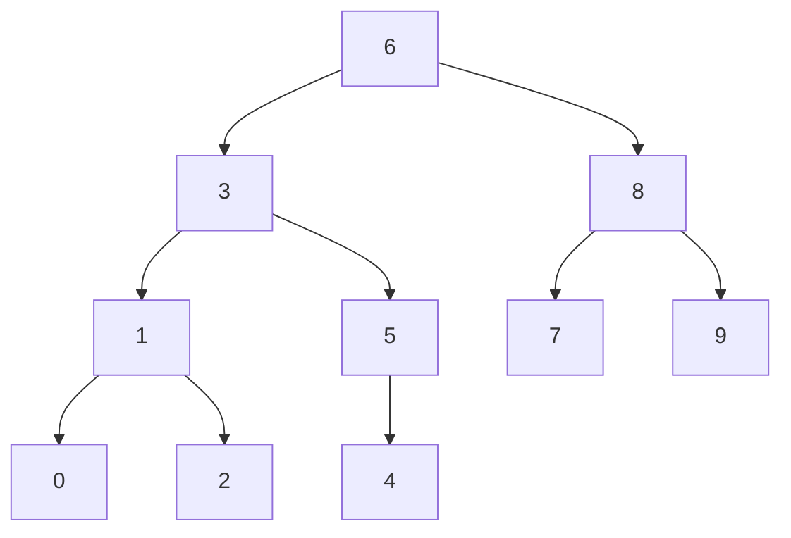

## 全文目录

[TOC]

> 注：
>
> 1.此篇文档是我在做题过程中觉得自己应该注意到的知识点，有些知识点在代码里并没有用到，只是我由某个地方扩展开来的。
>
> 2.写这篇文档仓促，因此并不是完全原创的，很多知识点都是现上网查，综合整理到文章里的（copy）。

------


## 第3章 入门模拟

### 【PAT B1001】 害死人不偿命的（3n+1）猜想 

**学习知识点：**   

**1.scanf和printf 输入输出控制**

> - scanf("输入控制符", 输入参数);
> - 功能：将从键盘输入的字符转化为“输入控制符”所规定格式的数据，然后存入以输入参数的值为地址的变量中
>

如： scanf("%d", &i);   *//&i 表示变量 i 的地址，&是取地址符*
假如键盘输入：123  
操作系统内核就是这样运作的。操作系统在接收键盘数据时都将它当成字符来接收的。这时就需要用“输入控制符”将它转化一下。%d的含义就是要将从键盘输入的这些合法的字符转化成一个十进制数字。经过 %d 转化完之后，字符 123 就是数字 123 了。  
第二个要弄清楚的是：&是一个取地址运算符，&后面加变量名表示“该变量的地址”，所以&i就表示变量 i 的地址。&i又称为“取地址i”，就相当于将数据存入以变量 i 的地址为地址的变量中。

如果输入一个字符串数组，则不需要加&了，因为字符串数组名本身已经代表了地址

char a[15];

scanf("%s%s",a)；


###  【PAT B1032】 挖掘机技术哪家强  
**学习知识点**：  

**1.数组初始化**  
C语言中，数组初始化的方式主要有三种：  

1. 声明时，使用 {0} 初始化；  
1. 使用memset；  
1. 用for循环赋值。  

其中for循环初始化速度最慢，而{0}和memset初始化速度差不多，原因在于其实{0}的汇编代码里也调用了memset。

注意：如果初始化数组元素都为1，使用int a[10]={1}是不对的，这样初始化的结果只定义了a[0]=1;其他默认为0，正确的做法是用循环初始化为1

**2、memset**

> 头文件：#include <string.h>
>
> 函数原型：void *memset(void *s, int c, size_t n)
>
> 功能：以s为起始位置的n个字节的内存区域用整数c进行填充
>
> 参数：s为内存区域的起始位置，c为要填充的字符，n为要填充多少个字节
>
> 返回值：目标s内存的起始地址

**注意：**

```
1、n表示的是字节数，函数是以字节的形式每次赋值给目标地址；
      2、memset函数也是以字节为单位进行赋值的，所以要想在整形数组中给每一位赋确定的非0值，一般来讲是不可行的；（下方将有对此说明测试的程序）
```
下面是针对注意事项的测试程序：

```

#include <stdio.h>  
#include <string.h>  
//memSet库函数的实现
void *memSet(void *s, int c, size_t n)  
{
	if (NULL == s || n < 0)
		return NULL;
	char * tmpS = (char *)s;
	while(n-- > 0)
		*tmpS++ = c;
	return s; 
}
int main()
{
	int buf[10];
	int i;
	printf("%d\n", sizeof buf);
	for (i = 0; i < 10; i++)
		printf("buf[%d] = %d\n", i, buf[i]); //未初始化buf
	printf("------------------------------------\n");
	memSet(buf, 1, sizeof(buf));  //memSet初始化buf
	for (i = 0; i < 10; i++)
		printf("buf[%d] = %d\n", i, buf[i]);
	return 0;
}
```
结果：


结果分析：可以看出得出的结果并没有得到想要的1，而得出不知道是什么的东西；

memset是按字节赋值的，取变量a的后8位二进制进行赋值。

1的二进制是（00000000 00000000 00000000 00000001），取后8位（00000001），int型占4个字节，当初始化为1时，它把一个int的每个字节都设置为1，也就是 0x01010101，

二进制是：00000001 00000001 00000001 00000001

十进制就是： 2^24 + 2^16 +  2^ 8 + 2^0 = 16843009

当把数组改成char buf[10]时，显示的结果如下：（更加证明是以字节方式赋值）


3. **fill() 区间赋值**

可以用 fill() 函数把数组或容器中的某一段区间赋为某个相同的值。和memset不同（memset对整型数组通常只能赋0)，这里的赋值可以是数组类型对应范围中的任意值，也可以当成一种初始化

```
需要头文件 #include <algorithm>
示例:
#include<algorithm>
#include<stdio.h>
using namespace std;
int main()
{
    int a[5];
    fill(a,a+5,123);
    for(int i=0;i<10;i++)
        printf(" %d",a[i]);
    return 0;
}
输出结果：
 123 123 123 123
```


### 【Codeup Contest ID:100000575 】

**知识点：**

```
1.sscanf函数
charnewSa[8];
sscanf(newSa,"%d",&A); //使用 sscanf把字符串数组newSa中的内容以"%d"的格式写到A中
注意newSa必须都是数字才能转成对应的数字
如char* newSa = "123";
//#include <stdlib.h>  中的atoi函数也可以实现把字符串转成整型
```


### 【codeup 1928】 日期差值

注意：闰年的计算方法： (year%4 == 0 && year %100 != 0 )   || (year % 400 == 0)

其他注意：

bool是c++定义的，所以如果提交到平台选择C compile的时候会报编译错误，解决这个问题：要么就选择C++编译，要么选择C编译时的文件里要加上头文件<stdbool.h>

在C语言标准(C89)没有定义布尔类型，所以会报错。而C99提供了一个头文件`<stdbool.h>`定义了`bool`，`true`代表1，`false`代表0。只要导入`stdbool.h`，就能非常方便的操作布尔类型了


## 第4章 算法初步

### 【 PAT A1025 】 PAT Ranking 

注意点：

1.段错误很可能是数组发生了越界访问

2.C语言里字符串数组  char s[] 是用strcmp（）来比较的

```c
函数：
int strcmp ( const char * str1, const char * str2 );
头文件：#include <string.h>
功能：字典序比较字符串str1和str2是否相等
返回：
1.str1完全等于str2，返回0
2.str1不等于str2 
	str1 < str2 ，返回 < 0 的数
	str1 < str2 ，返回 > 0 的数
```

3. C++ sort函数排序

   ```c
   函数：
   sort (first, last,cmp);
   其实first为首元素地址（必填），last为尾元素的下一个地址（必填），cmp为比较函数（非必填）
   如果没有填cmp参数，即 sort (first, last); 则默认按非降序方式排序
   头文件：#include <algorithm>
   功能：对位置[first,last)内的元素按照cmp比较方式进行排序
   返回：void型，没有返回，但是已将first,到last的元素排号序
   ```

   


### 【 PAT B1020 】 月饼 

用到了**贪心**的思想

1.scanf输入浮点数

```
double a;
scanf("%lf",&a);
```

2.printf输出浮点数保留两位小数

```
printf("%.2f",a);
```


### 【 PAT B1040/A1093 】 有几个PAT 

本题用暴力方法会超时。

计算PAT的个数实际上有规律：

对一个确定位置的A来说，以它形成的PAT个数等于它的左边P的个数乘以它的右边T的个数。

计算所有位置能够形成的PAT，那么对每一个有A的位置，先计算出它左边的P的个数和右边T的个数，num_P*num_T 的到此位置的PAT个数，再把所有位置累加起来。

```
函数：
cin.getline(char* s, streamsize n);
参数：字符串s，n表示读取到s中的最大长度，包括结束符
头文件：
#include<iostream> 
using namespace std;
用法：
#include<iostream> 
using namespace std;
char name[256];
cin.getline (name,256);
```

示例代码：

```
#include<stdio.h>
#include<iostream>
#include<string.h>

using namespace std;

const int region = 1000000007;
const int MAXN = 100010;
char str[MAXN];
int Pnum[MAXN] = {0};

int main()
{
    cin.getline(str,MAXN);
    int len = strlen(str);

    if(str[0] == 'P')
        Pnum[0] = 1;
    for(int i=1;i<len;i++){
        Pnum[i] = Pnum[i-1];
        if(str[i] == 'P')
            Pnum[i]++;
    }
    int Tnum=0;
    int PAT_num = 0;
    for(int j=len-1;j>0;j--){
        if(str[j] == 'T')
            Tnum++;
        else if(str[j] == 'A'){
            PAT_num = (PAT_num + Pnum[j]*Tnum)%region;
        }

    }
    printf("%d\n",PAT_num);
    return 0;

}
```


### 【PAT B1045/A1101】快速排序

> 题目：
>
> 著名的快速排序算法里有一个经典的划分过程：我们通常采用某种方法取一个元素作为主元，通过交换，把比主元小的元素放到它的左边，比主元大的元素放到它的右边。 给定划分后的 *N* 个互不相同的正整数的排列，请问有多少个元素可能是划分前选取的主元？
>
> 例如给定 $N = 5$, 排列是1、3、2、4、5。则：
>
> - 1 的左边没有元素，右边的元素都比它大，所以它可能是主元；
> - 尽管 3 的左边元素都比它小，但其右边的 2 比它小，所以它不能是主元；
> - 尽管 2 的右边元素都比它大，但其左边的 3 比它大，所以它不能是主元；
> - 类似原因，4 和 5 都可能是主元。
>
> 因此，有 3 个元素可能是主元。
>
> ### 输入格式：
>
> 输入在第 1 行中给出一个正整数 *N*（≤105）； 第 2 行是空格分隔的 *N* 个不同的正整数，每个数不超过 109。
>
> ### 输出格式：
>
> 在第 1 行中输出有可能是主元的元素个数；在第 2 行中按递增顺序输出这些元素，其间以 1 个空格分隔，行首尾不得有多余空格。
>
> ### 输入样例：
>
> ```in
> 5
> 1 3 2 4 5
> ```
>
> ### 输出样例：
>
> ```out
> 3
> 1 4 5
> ```


**直接思路（也即暴力方法）**：对每一个位置元素，向左排查是否有元素大于它，有就标记此元素非主元；左边满足都不大于此元素的情况下，向右排查是否有右边的元素小于它，同样有就标记此元素非主元；

此算法时间复杂度：对n个元素输出其中的非主元元素，每一个元素都要和其余的n-1个元素进行比较，复杂度为O( n*(n-1) ) = O( n^2 ) 

暴力算法在这题上提交会超时。

**更快算法：**

```
考察序列1：   3   7   5   8   10

   排序后：   3   5   7   8   10
```

可以观察到如果是主元元素，其排序后的位置和排序前的位置一样，如 3  8 10，而 5 和 7 都不是主元。

- 为什么主元元素排序前和后的位置一样呢？
- 答：我们知道对一个主元元素p来说，(假设序列各元素互异)，其前面a个元素都比它小，其后面b个元素都比它大，不管这a个元素和这b个元素内部是否排序，{a} < p < {b},元素p的位置是确定的，所以排序前这个位置是主元，那么排序后也必须是同样的数。

```
考察序列2：   1   2   8   4   3  5

   排序后：   1   2   3   4   8  5
```

序列2 里 数4排序前和排序后的位置一样，但是数4却不是主元，因为前面5比它,后面3又比它小，显然不是主元。

所以仅仅满足排序前后排序后位置一样而得出是主元的结论是不够的。

观察可以得到在这个序列里只有 1 和 2 是主元，  8  ,4,3 ,5都不是主元。

数5因为和排序后位置上的8不等，所以不是主元；

而对于数4，考察其位置，从序列开始到其位置的所有数中最大值应该是8，先不管4后面的数，我们知道在某一个位置对其前面所有元素来说最大值应该在此位置上，因为主元的左边都比它小。而数4前面有了比它大的数，所以数4就不是主元。同样数5也是一样的，对于数5位置来说，从序列开始到其位置的所有数中最大值也是8，即数5前面有了比它大的数，所以数5不是主元。

- 有人也许会问：

  对于位置 i 来说 已经满足其前面到此位置的所有数中的最大值在此位置上了，难道就不怕此位置后面有比其小的元素吗？

- 答：如果位置 i  已经满足其前面到此位置的所有数中的最大值在此位置上，那么其前面的元素一定小于位置i上的元素，而我们的第一个必要条件是【排序前此位置上的数和排序后此位置上的数相等】，就能保证位置 i 后面的元素都比其小。

综上：可以得到判断是主元的两个条件：

```
考察数组中某位置
1.排序前此位置上的数和排序后此位置上的数相等
2.此位置上的数也必须是从序列开始到此位置上的最大值
```

示例代码：

```
#include<stdio.h>
#include<algorithm>
using namespace std;

const int MAXN = 100010;
int A[MAXN];//原数组
int pivot[MAXN] = {0};//主元数组
int A_sorted[MAXN];//对原数组排序后的数组

int main()
{
    int n;
    int pivot_num = 0;
    scanf("%d",&n);
    for(int i=0;i<n;i++){
        scanf("%d",&A[i]);
        A_sorted[i] = A[i];
    }
    sort(A_sorted,A_sorted + n); //对原数组进行排序

    int max_num = 0;

    for(int i=0;i<n;i++){
        if(A[i] > max_num)
            max_num = A[i];//计算到从 序列开始 到 位置i 的 最大值
        if(A[i] == A_sorted[i] && A[i] == max_num)//满足上述所述两个条件
            pivot[pivot_num++] = A[i];

    }

    printf("%d\n",pivot_num);
    if(pivot_num > 0)
        printf("%d",pivot[0]);
    for(int i=1;i<pivot_num;i++){
        printf(" %d",pivot[i]);
    }
    printf("\n");
    return 0;
}
```


**时间复杂度分析**：sort排序O(nlogn),一个循环顺序扫描O(n),总的时间复杂度O(nlogn+n)

> 参考：

> [PAT B1045](https://pintia.cn/problem-sets/994805260223102976/problems/994805278589960192)

> [[1045. 快速排序](https://www.cnblogs.com/andywenzhi/p/5831431.html)](https://www.cnblogs.com/andywenzhi/p/5831431.html)


## 第5章 数学问题

### 【PAT B1019/A1069 】 数字黑洞


1.输出格式控制

整数统一有4位时，即 6677 输出为6677，0输出为0000，123输出为0123

```
printf("%04d - %04d = %04d\n",big,small,n);
```


题目解法，两种方法：

方法一：

将输入的整数按位转为整形数组，再对数组按升序和降序分别排序，对排序后的数组转为整数

代码示例：

```
#include<stdio.h>
#include<algorithm>
using namespace std;
/*
	bitnum:如bitnum=4表示4位整数
	功能：将整数转换为整型数组
	如：1234
	index   0 1 2 3
	num[]   4 3 2 1
*/
void toArray(int n,int num[],int bitNum){
    for(int i=0;i<bitNum;i++){
        num[i] = n%10;
        n /= 10;
    }
}

/*
	bitnum:如bitnum=4表示4位整数
	功能：将整型数组转换为整数
	如：1234
	index  0 1 2 3
asc:num[]  1 2 3 4
    result = ((1*10+2)*10+3)*10+4) = 1234
    
    index  0 1 2 3
dsc:num[]  4 3 2 1
    result = ((4*10+3)*10+2)*10+1) = 4321    
*/
int to_number(int num[],int bitNum){
    int result = 0;
    int a = 1;
    for(int i=0;i<bitNum;i++){
        result = result*10 + num[i];
    }
    return result;
}

bool dscCmp(int a,int b)
{
    return a>b;
}

int sortDsc(int num[],int n)
{
    sort(num,num+n,dscCmp);
    return to_number(num,4);
}

int sortAsc(int num[],int n)
{
    sort(num,num+n);
    return to_number(num,4);
}

int main()
{
    int n;
    scanf("%d",&n);
    int num[6];
    int bitNum = 4;
    do{
        toArray(n,num,bitNum);
        int big = sortDsc(num,bitNum);
        int small = sortAsc(num,bitNum);
        n = big - small;
        printf("%04d - %04d = %04d\n",big,small,n);

    }while(n!=0 && n!=6174);
    return 0;
}
```


方法二：

将整数转为字符串数组，再对数组按升序和降序分别排序，对排序后的数组转为整数

用了sprintf将整数转为字符串数组，注意一定要控制为4位整数进行转换，sprintf(num,"**%04d**",n)

如果没有控制4位，在题目输入的数据少于4位时，sprintf转换得到的 char num[]也少于4位（如输入为123或0123得到char num[]都是123），用少于4位的char num[]到后面 sort(num,num+4)的时候就会出错。

```
int sprintf ( char * str, const char * format, ... );
功能：把后面的参数按照format约定的格式转换并存储在str字符串中
返回:字符串str的长度
如：
char str[50];
int n;
sprintf (str, "%d", n ); //将整数n转换为字符串str

/* sprintf example */
#include <stdio.h>
int main ()
{
  char buffer [50];
  int n, a=5, b=3;
  n=sprintf (buffer, "%d plus %d is %d", a, b, a+b);
  printf ("[%s] is a string %d chars long\n",buffer,n);
  return 0;
}
Output:
[5 plus 3 is 8] is a string 13 chars long
```

用了sscanf 将字符串数组转为整数

代码示例：

```
#include<stdio.h>
#include<algorithm>
using namespace std;

bool dscCmp(int a,int b)
{
    return a>b;
}

int sortDsc(char num[],int n)
{
    sort(num,num+n,dscCmp);
    int result;
    sscanf(num,"%d",&result);//char* to int
    return result;
}

int sortAsc(char num[],int n)
{
    sort(num,num+n);
    int result;
    sscanf(num,"%d",&result);
    return result;
}

int main()
{
    int n;
    scanf("%d",&n);
    char num[5];
    int bitNum = 4;
    do{
        sprintf(num,"%04d",n); //int to char*
        int big = sortDsc(num,bitNum);
        int small = sortAsc(num,bitNum);
        n = big - small;
        printf("%04d - %04d = %04d\n",big,small,n);

    }while(n!=0 && n!=6174);
    return 0;
}
```


### 【PAT B1013】数素数

**判断一个数是否为素数:**

​			即除了1和它本身之外，没有其他因子，也即不能整除其他数。

**直接方法，复杂度O（n）:**

​			遍历2到n-1,判断n是否能整除这些数，存在能整除的，那么可以断定n不是素数，可以直接提前结束遍历。

**更高效的方法:**

​		假设对于n，其有除了1和n本身的因子k，也即 n%k = 0;  

​						也有 
$$
n/k * k = n
$$
那么 k 和 n/k都为n的因子，我们知道 
$$
\sqrt n * \sqrt n = n
$$
那么 n/k 与 k  中一定满足其中一个小于等于 sqrt(n),另一个大于等于sqrt(n)

由此可以推出，只要判断n能否被2,3,4,.....,└sqrt(n)┘ 中的一个整除，即可判定n是否为素数。因为如果在2到└sqrt(n)┘ 中都不存在能整除n的数，那么└sqrt(n)┘到n也必不存在，否则必有n/k * k = n。

该算法的复杂度为O（sqrt(n)）。


**构建素数表：**

找出1~n内的所有素数，直接的方法就是顺序遍历1~n,判断每一个数是否为素数，然后就可以得到一个由素数组成的素数表。此算法复杂度为O（n*sqrt(n)）

**构建素数表更高效的方法— 埃氏筛法**

基本思想：如果一个数是素数，则它的所有倍数都不是素数

具体操作：

1.初始一个素数标记表p[n]，大小为n，初始所有元素值为0，表示每一个都是素数

2.从2开始到n,判断是否被素数标记表标记为素数（即p[i] == 0）,是的话，将其小于n的的所有倍数在素数标记表里都标记为非素数（即 p[i] = 1），相当于将其筛出去。同时因为 i 是素数，那么就直接把 i 加入到素数表 prime中，即prime[num++] = i

算法正确性说明：

​	 当从小到大到达某数 a 时，如果 a 没有被前面步骤的数筛去，那么 a 一定输素数。因为如果 a 不是素数，那么a一定有小于a的素因子，这样在之前的步骤中a一定会被筛掉，所以，如果当枚举到a时还没有被筛掉，那么a一定是素数。

此算法复杂度为O（nloglogn）


代码示例：

```
#include<stdio.h>
#include<math.h>

using namespace std;

const int MAXN = 10000001;
int prime[10010];
bool primeTable[MAXN] = {0};//初始化所有数为素数

bool isPrime(int n){
    //根号n:pow(n,0.5)和sqrt(1.0*n)都可以
  //  double k = pow(n,0.5);
    int k = (int)sqrt(1.0*n);
    for(int i=2;i<=k;i++){
        if(n%i == 0){
            return false;
        }
    }
    return true;
}

//复杂度 O(MAXN*根号(MAXN)) = O(n*根号(n))
void findPrime(int n){
    int num=0;
    for(int i=2;i<MAXN;i++){
        if(isPrime(i)){
            prime[num++] = i;
            if(num>=n)
                break;
        }
    }
}


/*
  复杂度 O(MAXN*loglogMAXN) = O(n*loglogn)
*/
void createPrimeTable(int n){

    int prime_num = 0;
    for(int i=2;i<MAXN;i++){
        if(primeTable[i] == false){ //当 primeTable[i] 是一个素数时
            prime[prime_num++] = i;
            if(prime_num >= n)
                break;

            //素数的倍数都不是素数，将它们标记为“不是素数”
            for(int j=i*2;j<MAXN;j+=i){
                primeTable[j] = true;
            }

        }
    }
}

int main()
{
    int m,n;
    scanf("%d%d",&m,&n);

    //当MAXN>10^5时选用
    createPrimeTable(n);
    //MAXN<10^5时两者都可
    //findPrime(n);

    //输出格式
    int enter = 0;
    bool first = true;
    for(int i=m-1;i<n;i++){
        if(first){
             printf("%d",prime[i]);
             first = false;
        }
        else
            printf(" %d",prime[i]);
        enter++;
        if(enter%10 == 0){
            printf("\n");
            first = true;
        }
    }
    return 0;
}
```


### 【PAT A1059】Prime Factors


> 对一个正整数n来说，如果它存在1和本身之外的因子，那么一定是在sqrt(n)的左右成对出现的。
>
> 对一个正整数n来说，如果它存在 [2,n] ,范围内的质因子，要么这些质因子全部小于等于sqrt(n),要么只存在一个大于sqrt(n)的质因子。


示例代码：

```
#include<stdio.h>
#include<math.h>

using namespace std;

const int MAXN = 1000001;
int prime[MAXN];//prime table
int p[MAXN] = {0};//prime flag

struct fac{
    int p; //prime factor
    int exp; //exponent
}factors[10];

int createPrimeTable()
{
    int num=0;
    for(int i=2;i<MAXN;i++){
        if(p[i] == 0){
            prime[num++] = i;
            for(int j=i+i;j<MAXN;j+=i){
                p[j] = 1;
            }
        }
    }
    return num;
}

int main()
{
    int n;
    scanf("%d",&n);
    if(n == 1){
        printf("1=1\n");
        return 0;
    }

    printf("%d=",n);

    int sqrt_n = (int)sqrt(1.0*n);

    int prime_num = 0;
    prime_num = createPrimeTable();

    int flag = 0;
    int num_f = 0;
    for(int i=0;i<prime_num && prime[i] <= sqrt_n;i++)
    {
        if( n%prime[i] == 0)
        {
            factors[num_f].p = prime[i];
            n = n/prime[i];
            factors[num_f].exp++;
            flag = 1;
            while(n%prime[i]==0)
            {
                factors[num_f].exp++;
                n = n/prime[i];
            }
            num_f++;
        }
        if(n==1) break;//已经找到sqrt_n范围内的素因子了，及时退出节省时间
    }

    if(n!=1)//如果无法被sqrt_n以内的质因子除尽
    {
        factors[0].p = n;//那么一定有一个大于根号n的质因子
        factors[0].exp = 1;
        num_f = 1;
    }

    for(int i=0;i<num_f;i++){
        if(i>0)
           printf("*");

        printf("%d",factors[i].p);
        if(factors[i].exp>1)
             printf("^%d",factors[i].exp);
    }
    printf("\n");
    return 0;
}
```


## 第6章 C++标准模板库（STL）介绍

### 【PAT A1060】Are They Equal

>
> **测试数据**
>
> 4 0000 0000.00
> 4 00123.5678 0001235
> 3 0.0520 0.0521
> 4 00000.000000123 0.0000001230
> 4 00100.00000012 100.00000013
> 5 0010.013 10.012
> 4 123.5678 123.5
> 3 123.5678 123
> 4 123.0678 123
> 3 0.000 0
> 12 123456789012345 123456789012300
> 12 123456789012345 123456789010000


示例代码：

```
#include<iostream>
#include<math.h>
#include<string>

using namespace std;

/*
预处理字符串，将数字的无效前导0去掉
    如:
       000000789.66000 ->  789.66000
          00000.345000 ->  0.345000
*/
string init_deal_str(string s)
{
    string str="";
    int len = s.length();
    int flag = 0;
    for(int i=0;i<len;i++){
        if(s[i]!='0' || (s[i] == '0' && s[i+1] =='.')){
            str = s.substr(i,len - i);
            flag = 1;
            break;
        }
    }
    if(flag == 0)//针对 00000 的情况
    {
        str = "0";
    }
    return str;
}

/*
  获取底数
*/
string get_d(string a,int n)
{
    string d="";
    string temp_a = a;

    if(a[0] == '0')// a < 1
    {
        int i=0;
        while(a[i]=='0' || a[i]=='.'){
            i++;
        }
        temp_a = a.substr(i,a.length()-i);
    }

    int len = temp_a.length();

    if(len >= n)
    {
        int num = 0;
        for(int i=0;i<len;i++){
            if(temp_a[i] != '.'){
                d += temp_a[i];
                num++;
            }
            if(num >= n)
                break;
        }
    }
    else
    {
        string addStr = "";
        for(int i=0;i<n-len;i++)
            addStr+="0";
        d = temp_a + addStr;
    }
    d = "0." + d;

    return d;
}

/*
  获取指数
*/
int get_k(string a)
{
    int k=0;
    if(a[0] != '0') // a >= 1
    {
        if(a.find(".") != string::npos)
        {
            k = a.find(".");
        }else{
            k = a.length();
        }
    }
    else
    {
       int i=0;
       while(a[i]=='0' || a[i]=='.'){
            i++;
       }
       if(i == a.length())
       {
           k = 0;
       }else{
           k = (i - 2)*(-1);
       }
    }
    return k;
}

int main()
{
    int n;
    cin>>n;
    string a,b;
    cin>>a>>b;
    a = init_deal_str(a);
    b = init_deal_str(b);
    string a_d,b_d;//底数
    int a_k,b_k;//指数

   a_d = get_d(a,n);
   b_d = get_d(b,n);
   a_k = get_k(a);
   b_k = get_k(b);

   if(a_d == b_d && a_k == b_k)
   {
       cout<<"YES "<<a_d<<"*10^"<<a_k<<endl;
   }else{
       cout<<"NO ";
       cout<<a_d<<"*10^"<<a_k<<" ";
       cout<<b_d<<"*10^"<<b_k<<endl;
   }
    return 0;
}
```


## 第七章 数据结构专题（1）栈、队列、链表

### 【codeup 1918】 简单计算器


**考察知识点：**

栈，表达式计算

**由此引申的知识点：**

括号匹配，逆波兰表达式，树的中序遍历，后续遍历，中序遍历转后续遍历


一般的中缀表达式求值计算过程：

如：

30 / 90 - 26 + 97 - 5 - 6 - 13 / 88 * 6 + 51 / 29 + 79 * 87 + 57 * 92

（（ 0 + （1 + 23）/4 * 5 * 67 - 8 + 9  ) )


逻辑：

1. 运算符之间存在优先级关系，通常要事先约定好，如 * / 比 + - 要先计算
2. 从前往后扫描中缀表达式，后面的运算符因为优先级比较高可能会先计算，所以前面某些数和低优先级的运算符要先缓存，等待后面的运算完之后才能运算。
3. 一般都是有了两个数，一个运算符之后可以计算一个结果，计算的结果又可以作为等待被计算的数。
4. 由以上分析可以考虑建立两个栈，一个存放数值，另一个存放运算符。从前往后扫描，遇到数的时候直接入操作数栈，而遇到运算符先与栈顶运算符进行比较，如果栈顶运算符优先级比较高，此时栈顶运算符可以取出来运算了，同时取出操作数栈里的两个操作数一起运算，将运算结果再次存入到操作数栈中。

细节：

1. 初始时，操作数栈和运算符栈均为空，第一个运算符怎么和栈顶运算符做比较？

   答：为了实现循环的自动化，统一算法的处理流程，这里不妨初始时将先 ‘\0’也当做一个运算符 ，人为设置其第一个入栈，将 ‘\0’ 的优先级设置为最低，也就是说其他任何运算符和它比较优先级都比它高从而入栈。其实可以把‘\0’看成一个哨兵，这个哨兵在遇到其他运算符时都让它们入栈，而当扫描到表达式末尾，遇到表达式结束标志字符‘\0’时结束表达式运算。

​    2.什么时候表达式运算结束？

​		答：可以考虑扫描到字符串末尾的时候结束。或是当运算符栈为空时结束运算，前面已经把 '\0' 放入栈中，正      		常的运算符都比它优先级高，所以它不能出栈，C语言字符串都是以‘\0’结束的，所以当扫描到结束的‘\0’字符  时，让此时栈内唯一剩下的‘\0’出栈，它的使命结束了，‘\0’被出栈了，栈就为空了，也即表达式运算结束。

3. 除了‘）’，‘\0’,每个运算符都要入栈，只有入栈了，当扫描到其他运算符和它进行比较时，才有出栈运算的机会


先建立一个运算符优先级表，可以快速的找到运算符之间的关系，也避免代码中使用复杂冗余的if语句，使得代码更直观简洁高效。

运算符优先级表：

```
/*
   操作符优先级比较表
*/
                 //当前运算符   +    -    *     /   (    )  '\0'
char pri[7][7] = {
           /* 栈  +  */    {'>', '>', '<', '<', '<', '>','>'},
           /* 顶 -   */    {'>', '>', '<', '<', '<', '>','>'},
           /* 运 *   */    {'>', '>', '>', '>', '<', '>','>'},
           /* 算 /   */    {'>', '>', '>', '>', '<', '>','>'},
           /* 符 (   */    {'<', '<', '<', '<', '<', '=',' '},
           /*    )   */    {' ', ' ', ' ', ' ', ' ', ' ',' '},
           /*   '\0' */    {'<', '<', '<', '<', '<', ' ','='}

这个表什么意思？
想要这样的效果 pri[‘+’][‘*’] = ‘<’,pri[‘*’][‘/’] = ‘>’等，即栈顶运算符和当前运算符比较得到的关系，比如'+’和‘*’的到<，那么当前扫描到的运算符压栈
经过不同表达式的分析，可以得到栈顶运算符和当前运算符存在三种关系：
   关系                    操作
   <             栈顶运算符优先级低于当前运算符，当前运算符压栈
   >             栈顶运算符优先级高于当前元素运算符，栈顶运算符和对应操作数出栈 
   =             栈顶运算符优先级等同于当前元素运算符，栈顶运算符出栈
   
但是字符不能作为下标，所以先建立一个字符和数字之间的对应关系
先对  +    -    *     /   (    )  '\0' 这6个符号和 0 1 2 3 4 5 建立一个映射关系
map<char,int> opMap;
//建立运算符和下标的关系
opMap.insert(make_pair('+',0));
opMap.insert(make_pair('-',1));
opMap.insert(make_pair('*',2));
opMap.insert(make_pair('/',3));
opMap.insert(make_pair('(',4));
opMap.insert(make_pair(')',5));
opMap.insert(make_pair('\0',6));

那么 pri[opMap['+']][opMap['+']]就可以得到 '>',同理pri[opMap['+']][opMap['*']] = ‘<’

```


模拟：

（（ 0 + （1 + 23）/4 * 5 * 67 - 8 + 9  ) )

初始时：操作数栈numStack为空，运算符栈opStack放入‘\0’

开始从左往右扫描表达式字符串

```
扫描到的字符         操作                      numStack状态         opStack状态   

初始            '\0'入 opStack                   空                  '\0'

(              入 opStack                        空                 '\0'(               

(               入 opStack                       空                 '\0'((  

0               入 numStack                       0                '\0'(( 

+               入 opStack                       0                '\0'((+ 

(              入 opStack                         0               '\0'((+(            

1              入 numStack                        0 1                '\0'((+(

'+'            入 opStack                         0 1               '\0'((+(+                     
 23            入 numStack                         0 1 23             '\0'((+(+ 
 
)            + 出栈，并取出numStack                 0  24             '\0'((+(
              中前后两个操作数 1，23出栈做运算
              1+23 =23，将运算结果重新入numStack
              
           ‘）’继续和栈顶运算符比较，此时栈顶运
            算符为'(',将‘(’出栈，并让字符继续扫描       0  24              '\0'((+
             ，‘)’也不用再管
             
 /            入 opStack                           0  24              '\0'((+/
              
4             入 numStack                         0  24  4            '\0'((+/

*        * 和栈顶/做比较后，将/ 24  4 出栈，        0  6               '\0'((+
          24/4=6,6入栈
          
          * 继续和栈顶+比较后，*入栈                                  \0'((+*

5          入 numStack                           0  6 5           '\0'((+*

*       * 和当前opStack栈顶*做比较后，可进行运算，    0 30                 '\0'((+
		取* 6  5 ，6*5=30，将30入numStack
		
		* 继续和当前opStack栈顶+做比较后，          0 30                 '\0'((+*
		*入opStack
		
67      入 numStack                            0 30 67                 '\0'((+*

-      -和栈顶*比较后，将* 30 67 出栈，            0 2010                  '\0'((+
         30*67 = 2010  ，2010 入栈
         
         -和栈顶+比较后,将+，0 2010出栈             2010                  '\0'((
         0 + 2010 = 2010 ，2010入栈       
         
         -继续和栈顶(比较，-入栈                    2010                  '\0'((-
         
         
8        入 numStack                             2010 8                  '\0'((-

+      +和栈顶-比较后，将- 2010 8 出栈，             2002                   '\0'((
        2010-8=2002，2002入栈
        
        +继续和栈顶(比较，+入栈                     2002                 '\0'((+
 
9       入 numStack                              2002 9               '\0'((+

)      )和栈顶+比较后，将 + 0 2002出栈               2011                 '\0'((
       9+2002 = 2011 ，2011入栈         
     
      )继续和栈顶(比较，(出栈，                       2011                 '\0'(
      并继续扫描字符 
     
 )     )和栈顶(比较，(出栈，                         2011                 '\0'
      并继续扫描字符 
      
'\0'   '\0'和栈顶 '\0'比较后，栈顶 '\0'出栈          2011                  空 

      
opStack为为空时，表达式运算结束，最后结果即是numStack中最后剩下的唯一的数，也即2011
         

```


步骤：

1. 读入表达式，预处理去掉空格（空格位于数字和符号之间）
2. 建立运算符优先级关系表
3. 扫描表达式，分析表达式中的数字和运算符，从表达式中提取出操作数和运算符，根据运算符的优先级关系分为几种情况： ‘<’ 运算符入栈,并继续扫描； '>' 取出栈顶运算符和操作数做运算； ‘=’ 取出栈顶运算符丢弃，并继续扫描。
4.  重复步骤3直至 运算符栈为空


示例代码：

> 测试数据：
>
> 30 / 90 - 26 + 97 - 5 - 6 - 13 / 88 * 6 + 51 / 29 + 79 * 87 + 57 * 92
>
> （（ 0 + （1 + 23）/4 * 5 * 67 - 8 + 9  ) )


```
#include<iostream>
#include<stack>
#include<string.h>
#include<stdio.h>
#include<iomanip>
#include<map>
#include <sstream>
using namespace std;

/*
测试用例：
30 / 90 - 26 + 97 - 5 - 6 - 13 / 88 * 6 + 51 / 29 + 79 * 87 + 57 * 92
0
*/
const int NUMOP = 7;
/*
   操作符优先级比较表
*/
              //当前运算符   +    -    *     /   (    )  '\0'
char pri[NUMOP][NUMOP] = {
               /*  +   */    {'>', '>', '<', '<', '<', '>','>'},
               /*  -   */    {'>', '>', '<', '<', '<', '>','>'},
               /*  *   */    {'>', '>', '>', '>', '<', '>','>'},
               /*  /   */    {'>', '>', '>', '>', '<', '>','>'},
               /*  (   */    {'<', '<', '<', '<', '<', '=',' '},
               /*  )   */    {' ', ' ', ' ', ' ', ' ', ' ',' '},
               /* '\0' */    {'<', '<', '<', '<', '<', ' ','='}


                        };
map<char,int> opMap;
void createOpTable()
{
    //建立运算符和下标的关系
    opMap.insert(make_pair('+',0));
    opMap.insert(make_pair('-',1));
    opMap.insert(make_pair('*',2));
    opMap.insert(make_pair('/',3));
    opMap.insert(make_pair('(',4));
    opMap.insert(make_pair(')',5));
    opMap.insert(make_pair('\0',6));
}
/*
    判断当前的字符是操作符还是数，是数则返回true,否则返回false
    并且从字符串中提取数
*/
bool readNumber(char* &sp,double &number)
{
    char num_s[9] = {0};
    if(*sp >= '0' && *sp <= '9'){
        int i=0;
        while(*sp >= '0' && *sp <= '9')
        {
            num_s[i++] = *sp;
            sp++;
        }
        sscanf(num_s,"%lf",&number);
        return true;
    }else{
        return false;
    }
}

int main()
{
    createOpTable();
    string str;
    string RPN; //逆波兰表达式

    while(getline(cin,str) && str!="0"){

        stack<double> numberStack;
        stack<char> operatorStack;
        operatorStack.push('\0');

        //删除表达式str中的空格
        for(int i=0;i<str.length();i++)
        {
            if(str[i]==' '){
                str.erase(i,1);
            }
        }
     //   cout<<"after initial:"<<str<<endl;

        char ss[210]={0};
        //将string转为str[]数组
        str.copy(ss,210);
        //设置字符指针，用来遍历表达式
        char* sp = ss;

        while(!operatorStack.empty())
        {
             double number;
             char op;
             if(readNumber(sp,number))
             {
                numberStack.push(number);
                cout<<"number:"<<number<<endl;
                char ss[5];
                sprintf(ss,"%d",(int)number);
                string strnumber = ss;
                RPN += strnumber;
             }
             else
             {
                op = *sp;
                char stackOp = operatorStack.top();
                cout<<"stackOp:"<<stackOp<<"  cuOp:"<<op<<endl;
                char order = pri[opMap[stackOp]][opMap[op]];
                switch(order){
                case '<':
                    operatorStack.push(op);
                    sp++;
                    break;
                case '>':{
                     double numB = numberStack.top();
                     numberStack.pop();
                     double numA = numberStack.top();
                     numberStack.pop();
                     double numSum;
                     switch(stackOp){
                        case '+':
                             numSum = numA + numB;
                             printf("%f + %f = %f\n",numA,numB,numSum);
                        break;
                        case '-':
                             numSum = numA - numB;
                             printf("%f - %f = %f\n",numA,numB,numSum);
                        break;
                        case '*':
                             numSum = numA * numB;
                             printf("%f * %f = %f\n",numA,numB,numSum);
                        break;
                        case '/':
                             numSum = numA / numB;
                             printf("%f / %f = %f\n",numA,numB,numSum);
                        break;
                     }
                     numberStack.push(numSum);
                     operatorStack.pop();
                     RPN += stackOp;
                  }
                  break;
                case '=':
                    operatorStack.pop();
                    break;
                default:
                    break;
                }
             }
        }

        if(!numberStack.empty())
        {
            cout<<"final result: "<<endl;
            cout<<fixed << setprecision(2)<<numberStack.top()<<endl;
        }
        cout<<"逆波兰表达式 RPN："<<RPN<<endl;
    }
    return 0;
}
```


### 【PAT A1032】 Sharing

知识点：

静态链表

静态链表不用像动态链表那样用指针创建每一个链表结点，用指针来指向下一个链表结点，而是用数组来表示静态链表。创建一个结构体数组，每个结构体里有数据域和下一个结点的地址（只不过这个地址是int类型的）。数组下标就作为当前结点的地址。静态链表适用于给定的地址范围不是很大，如地址为5位数6位数内都可以。

> 测试数据：
>
> ### Sample Input 1:
>
> ```in
> 11111 22222 9
> 67890 i 00002
> 00010 a 12345
> 00003 g -1
> 12345 D 67890
> 00002 n 00003
> 22222 B 23456
> 11111 L 00001
> 23456 e 67890
> 00001 o 00010
> ```
>
> ### Sample Output 1:
>
> ```out
> 67890
> ```
>
> ### Sample Input 2:
>
> ```in
> 00001 00002 4
> 00001 a 10001
> 10001 s -1
> 00002 a 10002
> 10002 t -1
> ```
>
> ### Sample Output 2:
>
> ```out
> -1
> ```

代码：

```
#include<iostream>
#include<stdio.h>

struct node{
    char data;
    int next;
    int flag;
    node()
    {
        flag = 0;
    }
}Node[100010];


int main()
{
    int aStart,bStart;
    int n;
    scanf("%d%d%d",&aStart,&bStart,&n);
    int address;
    char data;
    int nextAddress;
    for(int i=0;i<n;i++)
    {
        scanf("%d %c %d",&address,&data,&nextAddress);
        Node[address].data = data;
        Node[address].next = nextAddress;
    }
    for(int i=aStart;i!= -1; i=Node[i].next)
    {
        Node[i].flag = 1;
    }
    bool has = false;
    for(int i=bStart;i!= -1; i=Node[i].next)
    {
        if(Node[i].flag == 1)
        {
            printf("%05d\n",i);
            has = true;
            break;
        }
    }
    if(!has)
        printf("-1\n");
}
```


### 【PAT A1052】 Linked List Sorting

这题有点坑啊，没有讲输入时可能存在无效结点。测试用例也也没有体现，所以有两个测试点过不了。哎，不过这些边界情况还是应该要想到的，怪不得我就奇怪输入里面给的原始链表的前后关系好像没有用到，原来题目是不会白给你东西的，给了的都要用上。

> 测试用例
>
> ### Sample Input:
>
> ```in
> 5 00001
> 11111 100 -1
> 00001 0 22222
> 33333 100000 11111
> 12345 -1 33333
> 22222 1000 12345
> ```
>
> ### Sample Output:
>
> ```out
> 5 12345
> 12345 -1 00001
> 00001 0 11111
> 11111 100 22222
> 22222 1000 33333
> 33333 100000 -1
> ```
>
> 另加的测试用例：
>
> ```
> input:
> 5 22222
> 12345 -1 00001
> 00001 0 11111
> 11111 100 22222
> 22222 1000 -1
> 33333 100000 44444
> 
> output:
> 1 22222
> 22222 1000 -1
> ```
>
> ```
> input:
> 0 -1
> 
> output:
> 0 -1
> ```


```
#include<iostream>
#include<stdio.h>
#include<algorithm>

using namespace std;

const int MAXN = 100010;

struct node{
    int data;
    int next;
    int address;
    int flag;
}Node[MAXN];

bool cmp(node a,node b)
{
    if(a.flag == 0 || b.flag ==0)
        return a.flag > b.flag;//将无效结点放到数组后面去
    else
     return a.data < b.data;//如果都是有效结点，则按要求从小到大排序
}

int main()
{
    for(int i=0;i<MAXN;i++)
    {
        Node[i].flag = 0;//初始都为无效结点
    }
    int start;
    int n;
    scanf("%d%d",&n,&start);
    int address;
    for(int i=0;i<n;i++)
    {
        scanf("%d",&address);
        scanf("%d%d",&Node[address].data,&Node[address].next);
        Node[address].address = address;
    }

    int p = start;
    int cnt = 0;
    while(p!= -1)
    {
        Node[p].flag = 1;
        p =  Node[p].next;
        cnt++;
    }

    if(cnt == 0)  //注意：新链表中没有结点的时候输出 0 -1
    {
       printf("0 -1\n");
       return 0;
    }
    sort(Node,Node+MAXN,cmp);
    printf("%d %05d\n",cnt,Node[0].address);
    for(int i=0;i<cnt-1; i++)
    {
       printf("%05d %d %05d\n",Node[i].address,Node[i].data,Node[i+1].address);
    }
    printf("%05d %d -1\n",Node[cnt-1].address,Node[cnt-1].data);
    return 0;
}
```


### 【PAT A1051】Pop Sequence  【第一遍不会做】

方法：按照给的出栈序列，模拟入栈出栈的过程，模拟过程中进行排除，结尾进行排除

测试样例：

> ### Sample Input:
>
> ```in
> 5 7 5
> 1 2 3 4 5 6 7
> 3 2 1 7 5 6 4
> 7 6 5 4 3 2 1
> 5 6 4 3 7 2 1
> 1 7 6 5 4 3 2
> ```
>
> ### Sample Output:
>
> ```out
> YES
> NO
> NO
> YES
> NO
> ```

版本一：

```
#include<iostream>
#include<stdio.h>
#include<stack>

using namespace std;

const int MAXN = 1010;
int A[MAXN];

/*
  函数功能：是否为可能的出栈序列
  是则返回true,否则返回false
*/

bool possibleSeq(int m,int n)
{
   int seq = 1;//原始入栈序列 1 2 3 4 5 6 7 ....
   stack<int> sta;
   int i=0;
   while(i<n)//从头至尾扫描某一可能的出栈序列:5 6 4 3 7 2 1
   {
       if(sta.empty())
       {
          sta.push(seq++);
       }
       while(sta.top()!=A[i])
       {
           if(sta.size() > m) //push进栈的元素个数大于了栈的容量
             return false;
           sta.push(seq++);
       }
      if(sta.size() > m)//sta.top()==A[i]时的栈的元素个数和栈容量还没比较
         return false;
      if(!sta.empty()&&sta.top()== A[i])
      {
          sta.pop();//pop序列元素和栈顶元素相等了,栈顶元素出栈
          i++;
      }
   }
   if(sta.empty())
     return true;
   return false;
}

int main()
{
    int m,n,k;
    scanf("%d%d%d",&m,&n,&k);
    for(int i=0;i<k;i++)
    {
        for(int j=0;j<n;j++)
        {
            scanf("%d",&A[j]);
        }
        if(possibleSeq(m,n))
            printf("YES\n");
        else{
            printf("NO\n");
        }
    }
    return 0;
}
```

版本二：这个版本更好理解一点，也更简洁（此版本参照《算法笔记》上面的代码）

```
#include<iostream>
#include<stdio.h>
#include<stack>

using namespace std;

const int MAXN = 1010;
int A[MAXN];

/*
  函数功能：是否为可能的出栈序列
  是则返回true,否则返回false
*/

bool possibleSeq(int m,int n)
{
   int current = 0;//待检测是否可能的序列的下标
   stack<int> sta;
   for(int i=1;i<=n;i++)//入栈顺序:1 2 3 4 5 6 7.....
   {
        sta.push(i);
        if(sta.size() > m)
            return false;
        while(!sta.empty()&&sta.top()==A[current])
        {
            sta.pop();
            current++;
        }
   }
   if(sta.empty())
     return true;
   return false;
}

int main()
{
    int m,n,k;
    scanf("%d%d%d",&m,&n,&k);
    for(int i=0;i<k;i++)
    {
        for(int j=0;j<n;j++)
        {
            scanf("%d",&A[j]);
        }
        if(possibleSeq(m,n))
            printf("YES\n");
        else{
            printf("NO\n");
        }
    }
    return 0;
}
```


### 【PAT A1056】Mice and Rice

> 输入样例：
> 11 3 //11个玩家，每3个玩家为1组
> 25 18 0 46 37 3 19 22 57 56 10 //第i只老鼠的重量
> 6 0 8 7 10 5 9 1 4 2 3 //初始玩家序列
> 输出样例:
> 5  5 5 2 5 5 5 3 1 3 5 //第i个玩家的排名

我自己写的通过了的代码,但是过于复杂，还用了很多数组和队列，空间消耗也大

参考《算法笔记》之后重新实现的代码，只使用一个队列，这个队列存放的始终使是老鼠原始的下标，而不是我之前的写法放的是老鼠。队列初始时为所有参赛的老鼠。这个队列相当于一个循环队列，每一轮取出每NG只老鼠为一组并找出其中质量最大的老鼠，然后把这只老鼠的下标重新放入队尾。当这一轮比赛完的时候，这一轮原先的老鼠都pop出去了，而push进来的是下一轮的老鼠，可以继续参与下一轮的比赛。

```
#include<iostream>
#include<stdio.h>
#include<queue>
using namespace std;

const int MAXN = 1010;
struct mouse{
    int weight;//质量
    int rankNum;//排名
}Mice[MAXN];

int main()
{
    int NP,NG;//NP只老鼠，每NG只老鼠为一组进行比赛
    scanf("%d%d",&NP,&NG);
    for(int i=0;i<NP;i++)
        scanf("%d",&Mice[i].weight);//输入第i只老鼠的重量

    queue<int> succMice;//每一轮剩下继续参与比赛的老鼠的下标队列
    int ini_order;
    for(int i=0;i<NP;i++)
    {
        scanf("%d",&ini_order);//输入初始分组序列
        succMice.push(ini_order);
    }
    int curr_turn_mice = NP;//每一轮参与比赛的老鼠总数
    int group;//每场比赛的分组数

    while(curr_turn_mice != 1)//直到最后一轮只剩下一只老鼠，结束整个比赛
    {
        if(curr_turn_mice%NG == 0)
            group = curr_turn_mice/NG;
        else
            group = curr_turn_mice/NG +1;
       for(int i=0;i<group;i++)//每一场比赛有group要分别选出最大的老鼠
       {
           int maxIndex = succMice.front();
           for(int j=0;j<NG;j++)//每一组从NG个老鼠中挑出最大的
           {
               //最后一组不足NG只,已完成这组排序
               if(i*NG+j+1 > curr_turn_mice) break;
               int index = succMice.front();
               Mice[index].rankNum = group+1;//当前轮所有老鼠的排名为group+1

               if(Mice[index].weight > Mice[maxIndex].weight)
                {
                    maxIndex = index;
               }
               succMice.pop();
           }
           succMice.push(maxIndex);//每组胜出的老鼠
       }
       curr_turn_mice = succMice.size();//当前轮参与比赛老鼠的总数
    }

    if(!succMice.empty())
        Mice[succMice.front()].rankNum = 1;

    printf("%d",Mice[0].rankNum);
    for(int i=1;i<NP;i++)
        printf(" %d",Mice[i].rankNum);
    printf("\n");
    return 0;
}
```


### 【PAT B1025/A1074】反转链表

```in
输入：
00100 6 2
00000 4 99999
00100 1 12309
68237 6 -1
33218 3 00000
99999 5 68237
12309 2 33218
输出：
12309 2 00100
00100 1 00000
00000 4 33218
33218 3 68237
68237 6 99999
99999 5 -1

输入：
00000 6 3
00000 1 11111
11111 2 22222
22222 3 -1
33333 4 44444
44444 5 55555
55555 6 -1
输出：
22222 3 11111
11111 2 00000
00000 1 -1

输入：
00100 6 4
00000 4 99999
00100 1 12309
68237 6 -1
33218 3 00000
99999 5 68237
12309 2 33218
输出：
00000 4 33218
33218 3 12309
12309 2 00100
00100 1 99999
99999 5 68237
68237 6 -1


```

我自己的解法：

对每个结点设置了一个pre指针和一个next指针，对每k个结点反转即查找其pre指针就可以逆序输出。

同样这题要注意统计结点的有效个数，虽然题目没说，之前也是有一题链表的题也是这样，所以下回链表的题都要记得记录有效结点个数。

我写得这份代码看着稍微复杂点，实际上在模拟真正的链表了，我看别人都没有用pre指针，不过如果是模拟链表的思路都差不多。

```
#include<stdio.h>

using namespace std;

const int MAXN = 100010;

struct node{
    int data;
    int pre;
    int next;
}Node[MAXN];

int main()
{
    int startAddress,n,k;
    scanf("%d%d%d",&startAddress,&n,&k);
    int address;
    for(int i=0;i<n;i++)
    {
        scanf("%d",&address);
        scanf("%d%d",&Node[address].data,&Node[address].next);
    }

    if(startAddress == -1)//首地址是-1时直接输出
    {
        printf("-1\n");
        return 0;
    }

    Node[startAddress].pre = -1;
    int preAddress = startAddress;
    int valid_n = 1;//有效结点个数
    for(int i=Node[startAddress].next;i!=-1;i = Node[i].next)
    {
        Node[i].pre = preAddress;
        preAddress = i;
        valid_n++;
    }
    n = valid_n;
    int group = n / k;
    int remain = n%k;
    int groupStart_p = startAddress;
    int nextGroup_p;
    for(int i=0;i<group;i++)
    {
        int p = groupStart_p;//p相当于一个指针
        for(int j=0;j<k-1;j++)
        {
            p = Node[p].next;
        }
        groupStart_p = Node[p].next;//下一组遍历开始地址
        for(int j=0;j<k-1;j++)
        {
            printf("%05d %d %05d\n",p,Node[p].data,Node[p].pre);
            p = Node[p].pre;
        }
         if(i==group-1&&remain == 0)//能整除的最后一组的最后一个
             printf("%05d %d -1\n",p,Node[p].data);
         else if(i==group-1&&remain != 0)
         {
            printf("%05d %d %05d\n",p,Node[p].data,groupStart_p);
         }else{//否则每一组最后一个的next地址要等于下一组反转后开头地址
             nextGroup_p = groupStart_p;
             for(int j=0;j<k-1;j++)
             {
                  nextGroup_p = Node[nextGroup_p].next;
             }
            printf("%05d %d %05d\n",p,Node[p].data,nextGroup_p);
         }
    }
    int p2 = groupStart_p;
    if( remain != 0)//不足k个的不进行反转
    {
        while(remain > 1)
        {
            printf("%05d %d %05d\n",p2,Node[p2].data,Node[p2].next);
            p2 = Node[p2].next;
            remain--;
        }
        printf("%05d %d -1\n",p2,Node[p2].data);
    }
    return 0;
}
```

更简洁的代码的解法，利用#include<algorithm>里的reverse方法

```
#include<stdio.h>
#include<algorithm>

using namespace std;

const int MAXN = 100010;

struct node{
    int data;
    int next;
    int address;
}Node[MAXN],*SNode[MAXN];

int main()
{
    int startAddress,n,k;
    scanf("%d%d%d",&startAddress,&n,&k);
    int node_address;
    for(int i=0;i<n;i++)
    {
        scanf("%d",&node_address);
        scanf("%d%d",&Node[node_address].data,&Node[node_address].next);
        Node[node_address].address = node_address;
    }
    int j = 0;
    for(int i=startAddress;i!=-1;i=Node[i].next)
    {
        //之所以SNode生命为指针数组,是为了指向Node的地址,就不用重复拷贝了
        SNode[j++] = &Node[i];//SNode把Node按顺序紧凑的排在一起
    }

    for(int i=0;i<=j-k;i = i+k)
    {
        reverse(SNode+i,SNode+i+k);//反转每k个元素
    }

    for(int i=0;i<j-1;i++)
    {
       printf("%05d %d %05d\n",SNode[i]->address,SNode[i]->data,SNode[i+1]->address);
    }
    printf("%05d %d -1\n",SNode[j-1]->address,SNode[j-1]->data);

    return 0;
}
```


### 【PAT A1097】Depulication on a Linked List

> 测试样例
>
> ### Sample Input:
>
> ```in
> 00100 5
> 99999 -7 87654
> 23854 -15 00000
> 87654 15 -1
> 00000 -15 99999
> 00100 21 23854
> ```
>
> ### Sample Output:
>
> ```out
> 00100 21 23854
> 23854 -15 99999
> 99999 -7 -1
> 00000 -15 87654
> 87654 15 -1
> ```


参考算法笔记写的代码，我写的那个过于复杂了，而且把题目的有个意思弄错了，题目是要求把所有删除的结点链成一条，我弄成每个以每个绝对值删除的结点为一条链表了。

《算法笔记》的这个版本的代码确实感觉通用于PAT上链表这一类题，多学习多理解多记忆一下

```
#include<stdio.h>
#include<algorithm>
#include<math.h>
#include<string.h>

using namespace std;

const int MAXN = 100010;
const int MAXNUM = 10005;

bool numExist[MAXNUM] = {false};

struct node{
    int data;
    int next;
    int order;
    int address;
}Node[MAXN];

bool cmp(node a,node b)
{
    return a.order < b.order;
}

int main()
{
    memset(numExist,false,sizeof(numExist));
    for(int i=0;i<MAXN;i++)
        Node[i].order = 2*MAXN;//初始时设置每个结点为无效结点

    int startAddress,n;
    scanf("%d%d",&startAddress,&n);
    int node_address;
    int valid_num = 0;//有效结点个数
    for(int i=0;i<n;i++)
    {
        scanf("%d",&node_address);
        scanf("%d%d",&Node[node_address].data,&Node[node_address].next);
        Node[node_address].address = node_address;
    }
    int delete_num = 0;
    int reserve_num = 0;
    for(int i= startAddress;i!=-1;i = Node[i].next )
    {
         if(!numExist[abs(Node[i].data)])
         {
            Node[i].order = reserve_num;
            reserve_num++;
            numExist[abs(Node[i].data)] = true;
         }
         else{
            Node[i].order = MAXN+delete_num;
            delete_num++;
         }
    }
    sort(Node,Node+MAXN,cmp);
    valid_num = reserve_num + delete_num;
    for(int i=0;i<valid_num;i++)
    {
        if(i!=reserve_num-1 && i!=valid_num-1)
           printf("%05d %d %05d\n",Node[i].address,Node[i].data,Node[i+1].address);
        else
           printf("%05d %d -1\n",Node[i].address,Node[i].data);
    }
    return 0;
}
```


## 第8章 搜索专题 DFS BFS

### 【PAT A1103】Integer Factorization

2019-07-23

> 题目大意：
>
> 给3个整数 n , k ,p，满足 n = a~1~ ^p^  +   a~2~ ^p^  +   a~3~ ^p^  +   ...... +   a~k-1~ ^p^   +   a~k~ ^p^    
>
> 求满足这样的 a~1~   ,  a~2~   ,   a~3~ , ......  a~k-1~    ,   a~k~ 
>
> 如果有多对满足，则选择   a~1~ 到a~k~ 加起来最大的那组，同时在输出时 a~1~ 到a~k~ 按降序排列
>
> 测试用例：
>
> ### Sample Input 1:
>
> ```in
> 169 5 2
> ```
>
> ### Sample Output 1:
>
> ```out
> 169 = 6^2 + 6^2 + 6^2 + 6^2 + 5^2
> ```
>
> ### Sample Input 2:
>
> ```in
> 169 167 3
> ```
>
> ### Sample Output 2:
>
> ```out
> Impossible
> ```


方法思路：深搜我还不会自己写，所以这道题是参考《算法笔记》来写的，但是我知道这题肯定要用DFS算法来写。因为从题目意思看，首先的思路就是在一定范围内进行枚举满足题目要求的数集。而这个范围有上限，有下限，用DFS可以很好的帮助我们进行枚举。

用DFS首先要划定递归边界，什么时候结束，什么时候满足要求，其次是剪枝，当进行到一定程度的时候，可能已经不满足要求，及时返回，减少不必要的时间。

```
#include<stdio.h>
#include<vector>
using namespace std;

vector<int> facV,tempV,ansV;

//快速幂 求 a^b
int powM(int a,int b)
{
    int pow = 1;
    int p = a;
    while(b>0)
    {
        if(b&1)
            pow *= p;
        p *= p;
        b >>= 1;
    }
    return pow;
}
/*
    初始化预处理
    知道p之后就可以算出 1^p,2^p,3^p,4^p,5^p .....
    为接下来选择facV的值做准备
*/
void init(int n,int p)
{
    facV.push_back(0);
    int i=1;
    while(powM(i,p)<=n)
    {
        facV.push_back(powM(i,p));
        i++;
    }
}

int maxSumIndex = 0;
int n,k,p;
/*
function:深度优先搜索
params：
  index:当前进行到facV[]的哪一个数的下标
  nowK:当前已经选择了几个数
  sumIndex:这些下标的总和
  sumN:选择的数的总和
*/
void DFS(int index,int nowK,int sumIndex,int sumN)
{
    if(sumN == n && nowK == k)//满足要求
    {
        if(sumIndex > maxSumIndex)//选择下标和最大的一组
        {
            ansV = tempV;
            maxSumIndex = sumIndex;
        }
        return;
    }
    if(nowK >k ||sumN > n)
        return;//剪枝,这两种情况都不符合要求
    if(index -1 >=0)//递归边界,其中fac[0]不需要选择
    {
        tempV.push_back(index);
        DFS(index,nowK+1,sumIndex+index,sumN+facV[index]);//选择当前的index
        tempV.pop_back();
        DFS(index-1,nowK,sumIndex,sumN);//不选择当前的index，直接往深入走进入index-1
    }
}

int main()
{
    scanf("%d%d%d",&n,&k,&p);

    init(n,p);

    DFS(facV.size()-1,0,0,0);

    if(ansV.empty())
    {
        printf("Impossible\n");
        return 0;
    }

    printf("%d = %d^%d",n,ansV[0],p);
    for(int i=1;i<ansV.size();i++)
        printf(" + %d^%d",ansV[i],p);
    printf("\n");
    return 0;
}
```


### 【PAT A1091】Acute Stroke

2019-07-23

这是一道三维的广度优先搜索BFS,参考《算法笔记》实现的，这种题可以讨论《算法笔记》上的模板

```
#include<stdio.h>
#include<queue>
using namespace std;

int matrix[1290][130][61];
bool inq[1290][130][61] = {false};//用来标记某个点是否入过队

struct node{
    int x,y,z;
}Node;

//往四个方向试探,分别是右、下、左、上,其中
int X[6] = {1,0,-1,0,0,0};
int Y[6] = {0,1,0,-1,0,0};
int Z[6] = {0,0,0,0,1,-1};

int M,N,L,T;

bool judge(int x,int y,int z)
{
    //越界
    if(x >=M  || x <0 || y >=N ||y<0 || z >= L || z<0)
        return false;
    //当前位置上的值为0,或者(x,y)已入过队,都返回false
    if(matrix[x][y][z] ==0 || inq[x][y][z] == true)
        return false;
    return true;
}
//广度优先搜索
int BFS(int x,int y,int z)
{
    queue<node> Q;
    int sum = 0;
    Node.x = x,Node.y = y,Node.z = z;
    Q.push(Node);
    inq[x][y][z] = true;
    while(!Q.empty())
    {
        node top = Q.front();
        Q.pop();
        sum++;
        for(int i=0;i<6;i++)
        {
            int newX = top.x + X[i];
            int newY = top.y + Y[i];
            int newZ = top.z + Z[i];
            if(judge(newX,newY,newZ))
            {
                Node.x =newX,Node.y = newY,Node.z = newZ;
                Q.push(Node);
                inq[newX][newY][newZ] = true;
            }
        }
    }
    return sum;
}

int main()
{
    scanf("%d%d%d%d",&M,&N,&L,&T);
    for(int z=0;z<L;z++)
        for(int x=0;x<M;x++)
            for(int y=0;y<N;y++)
                scanf("%d",&matrix[x][y][z]);

    int AllSum = 0;
    int region_sum = 0;
    for(int z=0;z<L;z++){
        for(int x=0;x<M;x++){
            for(int y=0;y<N;y++){
                if(matrix[x][y][z] == 1 && inq[x][y][z] == false){
                    region_sum = BFS(x,y,z);
                    if(region_sum >= T){
                      //  printf("from(%d,%d,%d),region_sum:%d\n",x,y,z,region_sum);
                        AllSum += region_sum;
              }
            }
          }
      }
    }
    printf("%d\n",AllSum);
    return 0;
}
```


## 第9章 数据结构专题（2）—树

9.2

### 【PAT A1020】Tree Traversals

2019-07-24

> 题目意思：
>
> 给一个二叉树的后序遍历和中序遍历，求这颗二叉树对应的层次遍历序列
>
> 测试用例：
>
> ### Sample Input:
>
> ```in
> 7
> 2 3 1 5 7 6 4
> 1 2 3 4 5 6 7
> ```
>
> ### Sample Output:
>
> ```out
> 4 1 6 3 5 7 2
> ```

方法思路：先由二叉树的后序遍历和中序遍历创建二叉树，再通过二叉树的层次遍历来得到层次遍历序列

示例代码：

我顺便把由前序遍历和中序遍历创建二叉树、二叉树的前、中、后、层次遍历的代码写了并测试过

```
#include<stdio.h>
#include<queue>
using namespace std;

struct node{
    int data;
    node* left;
    node* right;
};

const int MAXN = 40;
int preOrder[MAXN];
int inOrder[MAXN];
int postOrder[MAXN];

node* newNode(int v)
{
    node* anode = new node;
    anode->data = v;
    anode->left = anode->right = NULL;
    return anode;
}

/*
  由前序遍历和中序遍历创建二叉树
  前序遍历下标:[preL,preR]
  中序遍历下标:[inL,inR]

*/
node* createByPre(int preL,int preR,int inL,int inR)
{
    node* root = new node;
    root->data = preOrder[preL];
    if(preL > preR)
        return NULL;
    int k;
    //在中序遍历中,找到前序遍历的那个节点,从而划分中序遍历为左子树和右子树
    for(k = inL;k<=inR;k++)
    {
        if(inOrder[k] == preOrder[preL])
            break;
    }
    int numLeft = k - inL;
    //左子树
    root->left = createByPre(preL+1,preL+numLeft,inL,k-1);
    //右子树
    root->right = createByPre(preL+numLeft+1,preR,k+1,inR);

    return root;
}

//后序遍历
void postTravel(node* root)
{
    if(root == NULL)
        return;
    postTravel(root->left);
    postTravel(root->right);
    printf(" %d",root->data);
}

//前序遍历
void preTravel(node* root)
{
    if(root == NULL)
        return;
    printf(" %d",root->data);
    preTravel(root->left);
    preTravel(root->right);
}
//中序遍历
void inTravel(node* root)
{
    if(root == NULL)
        return;
    inTravel(root->left);
    printf(" %d",root->data);
    inTravel(root->right);
}
//层次遍历
void layerTravel(node* root)
{
    queue<node*> treeQ;
    treeQ.push(root);
    bool first = true;
    while(!treeQ.empty())
    {
        //取出来访问
        node* now = treeQ.front();
        if(!first)
            printf(" %d",now->data);
        else{
            printf("%d",now->data);
            first =false;
        }
        treeQ.pop();
        if(now->left!=NULL)
            treeQ.push(now->left);
        if(now->right!=NULL)
            treeQ.push(now->right);
    }
    printf("\n");
}


/*
  由后序遍历和中序遍历创建二叉树
  后序遍历下标:[postL,postR]
  中序遍历下标:[inL,inR]
*/
node* createByPost(int postL,int postR,int inL,int inR)
{
    node* root = new node;
    root->data = postOrder[postR];

    if(postL > postR)
        return NULL;
    int k;
    //在中序中找到后序遍历的顶点,划分左右子树
    for(k=inL;k<=inR;k++)
        if(inOrder[k] == postOrder[postR])
            break;
    int numLeft = k - inL;
    //左子树
    root->left = createByPost(postL,postL+numLeft-1,inL,k-1);
    //右子树
    root->right = createByPost(postL+numLeft,postR-1,k+1,inR);
    return root;
}

int main()
{
    int n;
    scanf("%d",&n);
    for(int i=0;i<n;i++)
        scanf("%d",&postOrder[i]);
    for(int i=0;i<n;i++)
        scanf("%d",&inOrder[i]);
    node* root = createByPost(0,n-1,0,n-1);
     printf("preTravel:\n");
    preTravel(root);
    printf("layerTravel:\n");
    layerTravel(root);
    return 0;
}
```


### 【PAT A1086】Tree Traversals Again

2019-07-24

> 题目大意：
>
> 中序遍历可以通过栈来模拟，给你一个二叉树中序遍历的操作过程：有Push和Pop的操作，请你根据这个过程，写出这颗二叉树的后序遍历。
>
> ### Sample Input:
>
> ```in
> 6
> Push 1
> Push 2
> Push 3
> Pop
> Pop
> Push 4
> Pop
> Pop
> Push 5
> Push 6
> Pop
> Pop
> ```
>
> ### Sample Output:
>
> ```out
> 3 4 2 6 5 1
> ```

这题代码是我自己写出来的，也通过了，但是后来参考《算法笔记》上，自己的有几个地方写得不是很好就改了一下，改进的地方：1.输入 Push和整数时 2.后序遍历输出格式

```
#include<stdio.h>
#include<stack>
#include<iostream>
#include<string.h>

using namespace std;

//二叉树结点定义
struct node{
    int data;
    node* lchild;
    node* rchild;
};

const int MAXN = 40;
int preOrder[MAXN];
int inOrder[MAXN];
int postOrder[MAXN];

/*
  由前序遍历和中序遍历创建二叉树
  前序遍历下标:[preL,preR]
  中序遍历下标:[inL,inR]
*/
node* createByPre(int preL,int preR,int inL,int inR)
{
    node* root = new node;
    root->data = preOrder[preL];
    if(preL > preR)
        return NULL;
    int k;
    //在中序遍历中,找到前序遍历的那个节点,从而划分中序遍历为左子树和右子树
    for(k = inL;k<=inR;k++)
    {
        if(inOrder[k] == preOrder[preL])
            break;
    }
    int numLeft = k - inL;
    //左子树
    root->lchild = createByPre(preL+1,preL+numLeft,inL,k-1);
    //右子树
    root->rchild = createByPre(preL+numLeft+1,preR,k+1,inR);

    return root;
}

int n;
//后序遍历
int num = 0;
void postTravel(node* root)
{
    if(root == NULL)
        return;
    postTravel(root->lchild);
    postTravel(root->rchild);
    printf("%d",root->data);
    num++;
    if(num < n)
        printf(" ");
}

int main()
{
    scanf("%d",&n);
    stack<int> sta;
    char op[10];
    int pre = 0;
    int in = 0;
    int opNum = 2*n;
    int data;

    for(int i=0;i<opNum;i++){
        scanf("%s",op);
        if(strcmp(op,"Push") == 0){
            scanf("%d",&data);
            sta.push(data);
            preOrder[pre++] = data;
        }else{//此行是pop操作
            if(!sta.empty()){
                inOrder[in++] = sta.top();
                sta.pop();
            }
        }
    }
    node* root = createByPre(0,pre-1,0,in-1);
    postTravel(root);
    printf("\n");
    return 0;
}
```


### 【PAT A1102】Invert a Binary Tree

2019-07-24

> 题目大意：
>
> 给出一颗二叉树每个结点的左孩子编号和右孩子编号，输出这颗二叉树对应的反转二叉树的层次遍历和中序遍历。
>
> 测试用例：
>
> ### Sample Input:
>
> ```in
> 8
> 1 -
> - -
> 0 -
> 2 7
> - -
> - -
> 5 -
> 4 6
> ```
>
> ### Sample Output:
>
> ```out
> 3 7 2 6 4 0 5 1
> 6 5 7 4 3 2 0 1
> ```


思路方法：最后要得到的是镜像二叉树的层次遍历和中序遍历，那么在输入时就直接交换左右子树。这题给的结点都是按下标来给的，而且结点个数也不多，所以直接用静态链表。题目没有告诉树的根结点，那么就为每一个结点设置一个父节点，当输入某个结点的孩子结点的时候，孩子结点的父亲也确定了。输入完之后通过一趟遍历找出没有父节点的结点就是树根结点。然后再从树根结点开始层次遍历和中序遍历。

```
#include<stdio.h>
#include<queue>
#include<iostream>
#include<string.h>

using namespace std;

const int MAXN = 20;

//二叉树结点定义
struct node{
    int data;
    int lchild;
    int rchild;
    int father;
}Node[MAXN];//静态链表

int n;

//层序遍历
int numInLayer = 0;
void layerTravel(int root)
{
    queue<int> layerQ;
    layerQ.push(root);
    while(!layerQ.empty())
    {
        int top = layerQ.front();
        layerQ.pop();
        numInLayer++;
        printf("%d",top);
        if(numInLayer < n)
            printf(" ");
        if(Node[top].lchild != -1)
            layerQ.push(Node[top].lchild);
        if(Node[top].rchild != -1)
            layerQ.push(Node[top].rchild);
    }
}

//中序遍历
int numInorder = 0;
void InorderTravel(int root)
{
    if(root == -1)
        return;
    InorderTravel(Node[root].lchild);
    printf("%d",root);
    numInorder++;//注意在哪里输出就加在哪里
    if(numInorder < n)
        printf(" ");
    InorderTravel(Node[root].rchild);
}

int main()
{
    scanf("%d",&n);
    char lchild_s[5];
    char rchild_s[5];
    int lchild;
    int rchild;
    int father;

    //初始化
    for(int i=0;i<n;i++){
        Node[i].father = -1;
        Node[i].lchild = -1;
        Node[i].rchild = -1;
    }

    for(int i=0;i<n;i++){

        scanf("%s",rchild_s);//输入时就进行反转,即左右子树交换
        scanf("%s",lchild_s);

        if(strcmp("-",rchild_s)!=0){
             sscanf(rchild_s,"%d",&rchild);
             Node[i].rchild = rchild;
             Node[rchild].father = i;
        }
        if(strcmp("-",lchild_s)!=0){
            sscanf(lchild_s,"%d",&lchild);
            Node[i].lchild = lchild;
            Node[lchild].father = i;
        }
    }

    //找到根结点
    int rootIndex;
    for(int i=0;i<n;i++)
    {
        if(Node[i].father == -1)
           rootIndex = i;
    }

    layerTravel(rootIndex);
    printf("\n");
    InorderTravel(rootIndex);
    printf("\n");
    return 0;
}
```


9.3 

### 【PAT A1053】Path of Equal Weight

2019-07-24

> 题目大意：
>
> 给你一颗树，已知树的结点编号和对应的权重以及树每个结点的孩子，给定一个固定的权重limitWeight，求从根结点到叶子结点的权重之和等于这个limitWeight的所有路径，并按降序输出这些路径。
>
> ### Sample Input:
>
> ```in
> 20 9 24
> 10 2 4 3 5 10 2 18 9 7 2 2 1 3 12 1 8 6 2 2
> 00 4 01 02 03 04
> 02 1 05
> 04 2 06 07
> 03 3 11 12 13
> 06 1 09
> 07 2 08 10
> 16 1 15
> 13 3 14 16 17
> 17 2 18 19
> ```
>
> ### Sample Output:
>
> ```out
> 10 5 2 7
> 10 4 10
> 10 3 3 6 2
> 10 3 3 6 2
> ```

### 

思路方法：这是一道深度优先搜索DFS的题。我在写这题的前晚看了《算法笔记》上的思路和代码，第二天写的，所以脑子里全是别人的思路了，就当例题吧，深搜广搜的题要多做写才有那个逻辑。

V1：这个版本的节点路径是用数组实现的，下面一个版本用的是vector。用数组有直观的push操作，没有直观的pop操作，实际上pop操作不是没有进行，而是隐式的进行了：被新的结点直接覆盖了，这就相当于被pop掉了。

```
#include<stdio.h>
#include<vector>
#include<iostream>
#include<string.h>
#include<algorithm>

using namespace std;

const int MAXN = 110;

//二叉树结点定义
struct node{
    int data;
    vector<int> children;
    int weight;
}Node[MAXN];//静态链表

bool cmp(int a,int b)
{
    return Node[a].weight > Node[b].weight;
}

int n,nonLeafNodes,limitWeight;

//判断结点x是否为叶子结点
bool isLeaf(int x){
    if(Node[x].children.empty())
        return true;
    return false;
}

/*
    path[i]保存着选入路径上第i个结点的编号
    第0个结点默认入队
    所以path[num]，num从1开始，即编号0的孩子结点
    同时num也表示了path里的个数
*/
int path[MAXN]={0};

/*

    params:
    index:当前正在访问的结点下标
    num:当前入队的结点个数
    sum:当前入队的结点权重之和
*/
void DFS(int index,int num,int sum)
{
    if(sum > limitWeight)
        return;
    //到达叶子结点,且
    if(isLeaf(index)==true){
      if(sum != limitWeight)
        return;
      //路上的权重之和等于limitWeight
      if(sum == limitWeight){
        for(int i=0;i<num;i++){
            printf("%d",Node[path[i]].weight);
            if(i < num-1)
                printf(" ");
            else
                printf("\n");
        }
      }
      return;
    }

    //遍历所有孩子结点，对每一个孩子结点进行深度访问
    for(int i=0;i<Node[index].children.size();i++)
    {
        int childIndex = Node[index].children[i];
        path[num] = childIndex;//把当前结点加入队列
        //选一个孩子结点进行访问
        DFS(childIndex,num+1,sum+Node[childIndex].weight);
    }
}

int main()
{
    scanf("%d%d%d",&n,&nonLeafNodes,&limitWeight);
    for(int i=0;i<n;i++){
        scanf("%d",&Node[i].weight);
    }
    int faIndex;//father_index
    int childNodes;
    int chilIndex;//child_index
    for(int i=0;i<nonLeafNodes;i++){
        scanf("%d%d",&faIndex,&childNodes);
        while(childNodes--){
            scanf("%d",&chilIndex);
            Node[faIndex].children.push_back(chilIndex);
        }
        /*
            为了方便最后按非增序列(即降序)输出,先对孩子结点按序号排序
            DFS时就会从结点大的先开始，然后也先输出
        */
        sort(Node[faIndex].children.begin(),Node[faIndex].children.end(),cmp);
    }
    DFS(0,1,Node[0].weight);
    return 0;
}
```


V2：这个版本使用vector来实现把结点加入路径的，当进入某个结点的时候，把结点push进，当返回时pop出来

```
#include<stdio.h>
#include<vector>
#include<iostream>
#include<string.h>
#include<algorithm>

using namespace std;

const int MAXN = 110;

//二叉树结点定义
struct node{
    int data;
    vector<int> children;
    int weight;
}Node[MAXN];//静态链表

bool cmp(int a,int b)
{
    return Node[a].weight > Node[b].weight;
}

int n,nonLeafNodes,limitWeight;

//判断结点x是否为叶子结点
bool isLeaf(int x){
    if(Node[x].children.empty())
        return true;
    return false;
}
//用来装路径上加入的结点
vector<int> pathV;

/*
    params:
    index:当前正在访问的结点下标
    sum:当前入队的结点权重之和
*/
void DFS(int index,int sum)
{
    if(sum > limitWeight)
        return;
    //到达叶子结点,且
    if(isLeaf(index)==true){
      if(sum != limitWeight)
        return;
      //路上的权重之和等于limitWeight
      if(sum == limitWeight){
        for(int i=0;i<pathV.size();i++){
            printf("%d",Node[pathV[i]].weight);
            if(i < pathV.size()-1)
                printf(" ");
            else
                printf("\n");
        }
      }
      return;
    }

    //遍历所有孩子结点，对每一个孩子结点进行深度访问
    for(int i=0;i<Node[index].children.size();i++)
    {
        int childIndex = Node[index].children[i];
        pathV.push_back(childIndex);//把当前结点加入队列
        //选一个孩子结点进行访问
        DFS(childIndex,sum+Node[childIndex].weight);
        pathV.pop_back();//返回的时候pop出去
    }
}

int main()
{
    scanf("%d%d%d",&n,&nonLeafNodes,&limitWeight);
    for(int i=0;i<n;i++){
        scanf("%d",&Node[i].weight);
    }
    int faIndex;//father_index
    int childNodes;
    int chilIndex;//child_index
    for(int i=0;i<nonLeafNodes;i++){
        scanf("%d%d",&faIndex,&childNodes);
        while(childNodes--){
            scanf("%d",&chilIndex);
            Node[faIndex].children.push_back(chilIndex);
        }
        /*
            为了方便最后按非增序列(即降序)输出,先对孩子结点按序号排序
            DFS时就会从结点大的先开始，然后也先输出
        */
        sort(Node[faIndex].children.begin(),Node[faIndex].children.end(),cmp);
    }
    // 第0个结点默认入队
    pathV.push_back(0);
    DFS(0,Node[0].weight);
    return 0;
}
```


### 【PAT A1079】Total Sales of Supply Chain

2019-07-25


> 题目大意：存在供应商、零售商、经销商这样一个树状关系，供应商给某个商品定价，经过每一层经销商都会涨价r%,每个零售商现在各有商品n件（各自的n不同），问所有零售商销售的总价格。
>
> 测试用例：
>
> 10 1.80 1.00
> 3 2 3 5
> 1 9
> 1 4
> 1 7
> 0 7
> 2 6 1
> 1 8
> 0 9
> 0 4
> 0 3

思路方法：深搜DFS的题，根据题目的输入样例，用静态链表来存储这颗树。每个结点里包含所有孩子结点的集合、所含商品总数。DFS从根结点开始遍历，带上各自的编号和深度，编号是用来最后判断是否为叶子结点，而深度是用来到达叶子结点时计算此时的价格。定义一个全局的总价格变量，然后把所有叶子结点各自的销售额加起来就能得到总价格。

注意叶子结点的价格计算，我之前自己写了个循环乘，在最后一个测试点运行超时了，应该是测试用例结点深度很大，换成math里的pow方法，本身正好是double类型，如果是整数就要自己写个快速幂了。

```
#include<stdio.h>
#include<vector>
#include<iostream>
#include<string.h>
#include<algorithm>
#include<math.h>

using namespace std;

const int MAXN = 100010;

//二叉树结点定义
struct node{
    vector<int> children;
    double numProd;// amount of product
}Node[MAXN];//静态链表

int n;
double unitPrice;//the unit price given by the root supplier
double incRate;//the percentage rate of price increment

/*
    params:
    index:当前结点的下标
    depth:当前结点到达深度
*/
double sum = 0;
double nowPrice;
void DFS(int index,int depth)
{
    //到达叶子结点
    if(Node[index].children.empty()){
        nowPrice = unitPrice*pow(1+incRate,depth);
        sum += nowPrice*Node[index].numProd;
        return;
    }
    for(int i=0;i<Node[index].children.size();i++){
        int child_index = Node[index].children[i];
        DFS(child_index,depth+1);
    }
}

int main()
{
    scanf("%d%lf%lf",&n,&unitPrice,&incRate);
    incRate /= 100;
    int numChildren;
    int childIndex;
    for(int i=0;i<n;i++){
        scanf("%d",&numChildren);
        if(numChildren == 0){//零售商(叶子结点)
            scanf("%lf",&Node[i].numProd);//输入拥有的商品个数
        }else{//非零售商,输入孩子结点编号
            for(int j=0;j<numChildren;j++){
                scanf("%d",&childIndex);
                Node[i].children.push_back(childIndex);
            }
        }
    }
    DFS(0,0);
    printf("%.1f\n",sum);
    return 0;
}
```


### 【PAT A1090】Height Price in Supply Chain

2019-07-25

> 题目大意：存在供应商、零售商、经销商这样一个树状关系，供应商给某个商品定价，经过每一层经销商都会涨价 r%, 求能得到的最高单价，以及达到这个最高单价的结点个数。
>
> 测试用例：
>
> 输入：
>
> 9 1.80 1.00
>
> 1 5 4 4 -1 4 5 3 6 
>
> 输出：
>
> 1.85 2

思路方法：深搜DFS的题，和上题类似，只不过求的东西不一样。根据题目的输入样例，用静态链表来存储这颗树。每个结点里包含所有孩子结点的集合。DFS从根结点开始遍历，带上各自的编号和深度，编号是用来最后判断是否为叶子结点，而深度是用来到达叶子结点时计算此时的价格。定义一个全局最高价格，当达到叶子结点的时候和这个全局最高价格相比，大于它就更新全局最高价格。

```

```


### 【PAT A1094】The Longest Generation

2019-07-25

> 给你一个家谱图，计算哪一代的成员数最多，输出这一代及其成员个数
>
> 测试用例：
>
> 输入：
>
> 23 13
> 21 1 23
> 01 4 03 02 04 05
> 03 3 06 07 08
> 06 2 12 13
> 13 1 21
> 08 2 15 16
> 02 2 09 10
> 11 2 19 20
> 17 1 22
> 05 1 11
> 07 1 14
> 09 1 17
> 10 1 18
>
> 输出:
>
> 9 4

思路方法：这是一道广度优先搜索BFS的题。要求哪一层人数最多以及层数编号，那么每个结点就要包含各自的层号，其中树根结点层号定义为1，每一个结点的层号等于其父节点层号加1。在BFS过程中用一个数组来记录每层的个数和建立层数与层数所含结点个数之间的关系。BFS完之后遍历这个数组，找出最多结点个数及其层号即可。

```
#include<stdio.h>
#include<vector>
#include<iostream>
#include<string.h>
#include<algorithm>
#include<queue>

using namespace std;

const int MAXN = 110;

//二叉树结点定义
struct node{
    vector<int> children;
    int layer;
}Node[MAXN];//静态链表

/*
    hasFather[i]：编号为i的结点是否有父节点,有就为true,没有就为false
    用来帮助寻找根结点，只有根结点没有父节点
*/
bool hasFather[MAXN] = {false};

//layerNum[i]表示第i层所有的结点数
int layerNum[MAXN] = {0};

int n,m;

void BFS(int rootIndex){
    queue<int> Q;
    Q.push(rootIndex);
    while(!Q.empty()){
        int fNode = Q.front();
        Q.pop();
        int nowLayer = Node[fNode].layer + 1;
        layerNum[nowLayer] += Node[fNode].children.size();
        for(int i=0;i<Node[fNode].children.size();i++){
            int child = Node[fNode].children[i];
            Node[child].layer = nowLayer;
            Q.push(child);
        }
    }
}

int main()
{
    scanf("%d%d",&n,&m);
    int numChildren;
    int fatherIndex;
    int rootIndex;
    int childIndex;
    for(int i=0;i<m;i++){
        scanf("%d%d",&fatherIndex,&numChildren);
        for(int j=0;j<numChildren;j++){
            scanf("%d",&childIndex);
            Node[fatherIndex].children.push_back(childIndex);
            hasFather[childIndex] = true;
        }
    }

    for(int i=1;i<=n;i++){
        if(hasFather[i] == false){
            rootIndex = i;
            break;
        }
    }
    Node[rootIndex].layer = 1;//根结点的层数为1
    layerNum[1] = 1;//第一层只有一个结点
    BFS(rootIndex);

    int MaxLayerNumber=0;//包含最多人数的层号
    int MaxGenerationNum=0;//(最多人数的代)的人数
    for(int i=1;i<=n;i++){
        if(layerNum[i] > MaxGenerationNum){
            MaxGenerationNum = layerNum[i];
            MaxLayerNumber = i;
        }
    }
    printf("%d %d\n",MaxGenerationNum,MaxLayerNumber);
    return 0;
}
```


### 【PAT A1106】Lowest Price in Supply Chain

2019-07-25

> 题目大意：是供应链系列的题目，和A1079的输入形式基本类似，只不过这题求零售商(也就是叶子结点)中最后单价最小的结点个数以及对应的最小单价。

思路方：深搜DFS，定义一个全局变量最低价格变量，初始值定为一个很大的数，然后在DFS过程中当到达叶子结点时计算当前叶子结点的单价并与全局最低价格比较，比它低时就更新全局最低的价格，并重置拥有最低价格的结点个数为1，与全局最低价格相等时，拥有最低价格的结点个数加1。

```
#include<stdio.h>
#include<vector>
#include<iostream>
#include<string.h>
#include<algorithm>
#include<math.h>

using namespace std;

const int MAXN = 100010;
const double MAXPRICE = 100000000;

//二叉树结点定义
struct node{
    vector<int> children;
}Node[MAXN];//静态链表

int n;
double unitPrice;//the unit price given by the root supplier
double incRate;//the percentage rate of price increment

/*
    params:
    index:当前结点的下标
    depth:当前结点到达深度
*/
double sum = 0;
double nowPrice;
double lowestPrice = MAXPRICE;
int lowestNum = 0;
void DFS(int index,int depth)
{
    //到达叶子结点
    if(Node[index].children.empty()){
        nowPrice = unitPrice*pow(1+incRate,depth);
        if(nowPrice < lowestPrice){
            lowestPrice = nowPrice;
            lowestNum = 1;
        }else if(nowPrice == lowestPrice){
            lowestNum++;
        }
        return;
    }
    for(int i=0;i<Node[index].children.size();i++){
        int child_index = Node[index].children[i];
        DFS(child_index,depth+1);
    }
}

int main()
{
    scanf("%d%lf%lf",&n,&unitPrice,&incRate);
    incRate /= 100;
    int numChildren;
    int childIndex;
    for(int i=0;i<n;i++){
        scanf("%d",&numChildren);
        if(numChildren != 0){
           //非零售商,输入孩子结点编号
            for(int j=0;j<numChildren;j++){
                scanf("%d",&childIndex);
                Node[i].children.push_back(childIndex);
            }
        }
    }
    DFS(0,0);
    printf("%.4f %d\n",lowestPrice,lowestNum);
    return 0;
}
```


### 【PAT A1004】Counting Leaves

2019-07-25

> 题目大意：和A1094类似，是一道家族树谱的题，这道题是去数每一层没有孩子结点的结点个数，并从根结点到最后一层输出每一层没有孩子结点的结点个数
>
> ### Sample Input:
>
> ```in
> 2 1
> 01 1 02
> ```
>
> ### Sample Output:
>
> ```out
> 0 1
> ```


思路方法：用BFS广度优先搜索。每个结点加上layer的属性。全局定义一个数组用来记录每一层没有孩子的结点个数，层号就作为数组的index。当pop访问每个结点时，对相同层号的结点检查是否有孩子，没有孩子，则它所在层号的无孩子结点个数就加1.

```
#include<stdio.h>
#include<vector>
#include<iostream>
#include<string.h>
#include<algorithm>
#include<queue>

using namespace std;

const int MAXN = 110;

//二叉树结点定义
struct node{
    vector<int> children;
    int layer;
}Node[MAXN];//静态链表

/*
    hasFather[i]：编号为i的结点是否有父节点,有就为true,没有就为false
    用来帮助寻找根结点，只有根结点没有父节点
*/
bool hasFather[MAXN] = {false};

//layerNoChildNum[i]表示第i层没有孩子的结点个数
int layerNoChildNum[MAXN] = {0};

int n,m;
int treeLayer = 0;//树的层数

void BFS(int rootIndex){
    queue<int> Q;
    Q.push(rootIndex);
    while(!Q.empty()){
        int fNode = Q.front();
        Q.pop();
        int nowLayer = Node[fNode].layer;
        if(nowLayer > treeLayer){
            treeLayer = nowLayer;
        }
        if(Node[fNode].children.empty()){
            layerNoChildNum[nowLayer]++;
        }
        int nextLayer =  nowLayer + 1;
        for(int i=0;i<Node[fNode].children.size();i++){
            int child = Node[fNode].children[i];
            Node[child].layer = nextLayer;
            Q.push(child);
        }
    }
}

int main()
{
    scanf("%d%d",&n,&m);
    int numChildren;
    int fatherIndex;
    int rootIndex;
    int childIndex;
    for(int i=0;i<m;i++){
        scanf("%d%d",&fatherIndex,&numChildren);
        for(int j=0;j<numChildren;j++){
            scanf("%d",&childIndex);
            Node[fatherIndex].children.push_back(childIndex);
            hasFather[childIndex] = true;
        }
    }

    for(int i=1;i<=n;i++){
        if(hasFather[i] == false){
            rootIndex = i;
            break;
        }
    }
    Node[rootIndex].layer = 1;//根结点的层数为1
    BFS(rootIndex);

    for(int i=1;i<=treeLayer;i++){
        printf("%d",layerNoChildNum[i]);
        if(i < treeLayer)
            printf(" ");
    }
    printf("\n");
    return 0;
}
```


9.4

### 【PAT A1043】Is it a Binary Search Tree

2019-07-25

> 题目大意：给你一个二叉搜索树的前序遍历序列或二叉搜索树镜像树的前序遍历序列，判断给的这棵是不是真的二叉搜索树。
>
> ### Sample Input 1:
>
> ```in
> 7
> 8 6 5 7 10 8 11
> ```
>
> ### Sample Output 1:
>
> ```out
> YES
> 5 7 6 8 11 10 8
> ```
>
> ### Sample Input 2:
>
> ```in
> 7
> 8 10 11 8 6 7 5
> ```
>
> ### Sample Output 2:
>
> ```out
> YES
> 11 8 10 7 5 6 8
> ```
>
> ### Sample Input 3:
>
> ```in
> 7
> 8 6 8 5 10 9 11
> ```
>
> ### Sample Output 3:
>
> ```out
> NO
> ```


V1:同时建了二叉树和二叉镜像树，二叉树建立的时间复杂度O(n)。使用公共的先序遍历和后序遍历接口。先建二叉树，然后先序遍历和给定的序列做比较，如果不完全相等那么就再建二叉镜像树，将给定的序列与二叉镜像树的先序遍历比较，不等就是真的不等了。

```
#include<stdio.h>

const int MAXN = 1010;

int preOrder[MAXN];
int n;

struct node{
    int data;
    node* lchild;
    node* rchild;
};

void insertNode(node* &root,int data){
    if(root == NULL){
         root = new node;
         root->data  = data;
         root->lchild = root->rchild = NULL;
         return;
    }
     if(data < root->data){//小于父节点的值往左子树插入
        insertNode(root->lchild,data);
     }else{//大于等于父节点的值往右子树插入
        insertNode(root->rchild,data);
     }
}

void insertNodeMirror(node* &root,int data){
    if(root == NULL){
         root = new node;
         root->data  = data;
         root->lchild = root->rchild = NULL;
         return;
    }
     if(data < root->data){//小于父节点的值往右子树插入
        insertNodeMirror(root->rchild,data);
     }else{//大于等于父节点的值往左子树插入
        insertNodeMirror(root->lchild,data);
     }
}

//建二叉树,左节点小于根结点,右孩子大于等于根结点
node* createBiTree(int preOrder[],int n){
    node* root = NULL;
    for(int i=0;i<n;i++){
        insertNode(root,preOrder[i]);
    }
    return root;
}

//建二叉镜像树,左节点大于根结点,右孩子小于根结点
node* createBiTreeMirror(int preOrder[],int n){
    node* root = NULL;
    for(int i=0;i<n;i++){
        insertNodeMirror(root,preOrder[i]);
    }
    return root;
}

int pre = 0;
bool preEqual = true;
void preTravel(node* root){
    if(root == NULL)
        return;
    if(preOrder[pre++] != root->data){
        preEqual = false;
    }
    preTravel(root->lchild);
    preTravel(root->rchild);
}

int posTraNum = 0;
void postTravel(node* root){
    if(root == NULL){
        return;
    }
    postTravel(root->lchild);
    postTravel(root->rchild);
    posTraNum++;
    printf("%d",root->data);
    if(posTraNum < n)
        printf(" ");
}

void judgeBinaryTree(){
    node* root = createBiTree(preOrder,n);
    //前序遍历建好的树和输入序列做对比看是否完全相等
    preTravel(root);
    if(preEqual == false){
        //还有一次机会,继续建镜像树，看给的序列是否等于镜像树前序遍历
        node* rootMirror = createBiTreeMirror(preOrder,n);
        preEqual = true;//重置preEqual
        pre = 0;//重置pre到开始位置
        preTravel(rootMirror);
        if(preEqual == true){
             printf("YES\n");
             postTravel(rootMirror);//输出后序遍历
        }else{
            printf("NO\n");
        }
    }else{
        printf("YES\n");
        postTravel(root);//输出后序遍历
    }
}

int main(){
    scanf("%d",&n);
    for(int i=0;i<n;i++){
        scanf("%d",&preOrder[i]);
    }
    judgeBinaryTree();
    return 0;
}
```

V2：少了一次建树的过程，利用镜像树遍历就是原二叉树的左右相反，前序遍历变为：根→右→左 ，后序遍历变为 右→左→根。所以两颗树的前序和后序遍历都要单独分开写，不能共用。

```
#include<stdio.h>

const int MAXN = 1010;

int preOrder[MAXN];
int n;

struct node{
    int data;
    node* lchild;
    node* rchild;
};

void insertNode(node* &root,int data){
    if(root == NULL){
         root = new node;
         root->data  = data;
         root->lchild = root->rchild = NULL;
         return;
    }
     if(data < root->data){//小于父节点的值往左子树插入
        insertNode(root->lchild,data);
     }else{//大于等于父节点的值往右子树插入
        insertNode(root->rchild,data);
     }
}

//建二叉树,左节点小于根结点,右孩子大于等于根结点
node* createBiTree(int preOrder[],int n){
    node* root = NULL;
    for(int i=0;i<n;i++){
        insertNode(root,preOrder[i]);
    }
    return root;
}

int pre = 0;
bool preEqual = true;
void preTravel(node* root){
    if(root == NULL)
        return;
    if(preOrder[pre++] != root->data){
        preEqual = false;
    }
    preTravel(root->lchild);
    preTravel(root->rchild);
}
/*
    镜像树的前序遍历
    先遍历根结点,然后遍历右子树,再遍历左子树
*/
int mirrorPre = 0;
bool mirrorPreEqual = true;
void mirrorPreTravel(node* root){
     if(root == NULL)
        return;
    if(preOrder[mirrorPre++] != root->data){
        mirrorPreEqual = false;
    }
    mirrorPreTravel(root->rchild);
    mirrorPreTravel(root->lchild);
}

int posTraNum = 0;
void postTravel(node* root){
    if(root == NULL){
        return;
    }
    postTravel(root->lchild);
    postTravel(root->rchild);
    posTraNum++;
    printf("%d",root->data);
    if(posTraNum < n)
        printf(" ");
}

/*
    镜像树的“后序遍历”
    先遍历右子树,再遍历左子树,最后是根结点
*/
int mirrorPosTraNum = 0;
void mirrorPostTravel(node* root){
    if(root == NULL){
        return;
    }
    mirrorPostTravel(root->rchild);
    mirrorPostTravel(root->lchild);
    mirrorPosTraNum++;
    printf("%d",root->data);
    if(mirrorPosTraNum < n)
        printf(" ");
}

void judgeBinaryTree(){
    node* root = createBiTree(preOrder,n);
    //前序遍历建好的树和输入序列做对比看是否完全相等
    preTravel(root);
    if(preEqual == false){
        //还有一次机会,“前序遍历”镜像树
        mirrorPreTravel(root);
        if(mirrorPreEqual == true){
             printf("YES\n");
             mirrorPostTravel(root);//输出镜像树“后序遍历”
        }else{
            printf("NO\n");
        }
    }else{
        printf("YES\n");
        postTravel(root);//输出后序遍历
    }
}

int main(){
    scanf("%d",&n);
    for(int i=0;i<n;i++){
        scanf("%d",&preOrder[i]);
    }
    judgeBinaryTree();
    return 0;
}
```


###  *【PAT A1064】Complete Binary Search Tree

2019-07-25

> 题目大意：给你一个序列，要求用这个序列建一个完全二叉搜索树，并输出这棵完全二叉搜索树的层次遍历序列。（注：给定的序列里的数各不相同，能保证建出来的完全二叉搜索树唯一）
>
> ### Sample Input:
>
> ```in
> 10
> 1 2 3 4 5 6 7 8 9 0
> ```
>
> ### Sample Output:
>
> ```out
> 6 3 8 1 5 7 9 0 2 4
> ```


这题是我自己code通过的，通过找完全二叉树的规律。

方法思路：对给定的序列先进行排序形成有序序列，在有序序列里找到划分点（即树根），划分左右子树，然后再分别左右递归建树。

找划分点的方法：

一棵树如果是满二叉树，则树高和结点个数的关系为 2^h+1^  - 1 = N  (其中h为树的高度，规定根结点的高度为0，N为满二叉树的结点个数)。也即 h = log~2~(N+1) - 1 。 

考察题目当前给我们的 n 个结点（n不一定是满二叉树个结点），这里假设 n 不足满二叉树，即最底层的结点个数不满。

如：




1.计算树高当前 int h = log~2~(n+1)

2.计算除最底层之外，以上的结点个数  2^h - 1

3.计算最底层结点个数   bottomNodes =  n - (2^h - 1)

4.计算 最底层若是满的情况应有结点个数  fullBottomNodes =  2^h

5.分情况： 

- ​			若 ( bottomNodes <= fullBottomNodes /2 ) 即最底层左边没满，则此时整棵树的左边结点总数为

​				 leftNodes = upNodes/2 + bottomNodes  即 上面的一半加最底层实际所含结点个数

- ​            若( bottomNodes > fullBottomNodes /2 )  即最底层左边满了，那么此时整棵树的左边结点总数为

​				 leftNodes = upNodes/2 + fullBottomNodes /2 即 上面的一半加最底层满的一半

6.找到树的左边结点个数就可以用 left + leftNodes 来找到划分结点对应下标了 (序列区间 [ left,right ] )

实际上上述划分方法对满二叉树也同样试用，可亲自模拟。

示例代码：

```
#include<stdio.h>
#include<algorithm>
#include<math.h>
#include<queue>
using namespace std;

const int MAXN = 1010;
int seq[MAXN];

struct node{
    int data;
    node* lchild;
    node* rchild;
};

int N;

int squrt(int a){
    return a*a;
}

//2的快速幂,n为指数,即2^n
int pow2Q(int n){
    if(n == 0)
        return 1;
    return (n&1==1)?squrt(pow2Q(n>>1))<<1:squrt(pow2Q(n>>1));
}

/*
   在有序序列的闭区间[left,right]递归寻找划分点
   并创建树
   返回树根结点指针
*/
node* create(int left,int right){
    if(left > right)
        return NULL;
    int allNum = right - left + 1;
    double depth = log(allNum+1)/log(2);
    int in_depth = (int)depth;//当前树高,规定根结点高度为0
    int upNodes = pow2Q(in_depth) - 1;//除去最底层，上面的结点总数 
    int bottomNodes = allNum - upNodes;//最底层的结点总数
    int fullBottomNodes = upNodes + 1;//如果最底层是满的应有的结点总数
    int leftNodes;//根结点的左子树结点个数
    if(bottomNodes <= fullBottomNodes/2){//不足一半
         leftNodes = upNodes/2 + bottomNodes;
    }else{
          leftNodes = upNodes/2 + fullBottomNodes/2;
    }
    int divData = seq[left+leftNodes];//划分结点,将有序数组划分为左右子树
  //  printf("divData%d,leftNodes:%d\n",divData,leftNodes);
    node* root = new node;
    root->data = divData;

    root->lchild = create(left,left+leftNodes-1);//继续往划分出来的左边递归创建左子树
    root->rchild  = create(left+leftNodes+1,right);//继续往划分出来的右边递归创建左子树
    return root;
}

//层次遍历
int layPrNum = 0;
void layerTravel(node* root){
    queue<node*> Q;
    Q.push(root);
    while(!Q.empty()){
        node* aNode = Q.front();
        Q.pop();
        layPrNum++;
        printf("%d",aNode->data);
        if(layPrNum < N)
            printf(" ");
        else
            printf("\n");
        if(aNode->lchild != NULL){
            Q.push(aNode->lchild);
        }
        if(aNode->rchild != NULL){
            Q.push(aNode->rchild);
        }
    }
}

int main(){

    scanf("%d",&N);

    for(int i=0;i<N;i++){
        scanf("%d",&seq[i]);
    }
    sort(seq,seq+N);
    node*root = create(0,N-1);
    layerTravel(root);
    return 0;
}
```


### 【PAT A1099】 Build a Binary Search Tree

2019-07-29

> 题目大意：给你一棵二叉搜索树BST的结构模板，即这棵树的结构是建立好的，每个结点是否有左右子树也已确定。再给你一个序列，请你把这个序列填充到这棵BST中，并最终输出包含数据的BST的层次遍历序列。
>
> 如下图：
>
> 
>
> 左边是建立好的BST结构，左下是给定的序列，将这个序列正确填充后如右边图所示。
>
> ### Sample Input:
>
> ```in
> 9
> 1 6
> 2 3
> -1 -1
> -1 4
> 5 -1
> -1 -1
> 7 -1
> -1 8
> -1 -1
> 73 45 11 58 82 25 67 38 42
> ```
>
> ### Sample Output:
>
> ```out
> 58 25 82 11 38 67 45 73 42
> ```


思路方法：这题和A1064类似，相同的划分左右子树思想。不同的是这个是按照题目指定的左子树结点个数和右结点个数划分的。既然题目规定了BST的结构，那么就要首先了解这个结构，通过从根结点的递归初始每个结点的左右子树结点个数。将给定的序列seq排好序。然后从根结点开始填充数据，怎么填充呢？既然每个结点都已经包含了自己左子树结点个数和右子树结点个数，假设根结点左子树结点个数为leftNum,右子树结点个数为rightNum,那么排好序seq中符合左边有leftNum比它小的数，右边有rightNum个比它大的数的那个数就是此时根结点找到要填充的数。实际上若seq区间为 [ left，right ]，seq[ left + leftNum] 即为根结点填充的数。与此同时，这个数将区间划分为了左右子树，左子树区间为 [ left，left + leftNum-1]，右子树区间为 [ left + leftNum+1，right]，分别向两边填充即可。

示例代码：

```
#include<stdio.h>
#include<algorithm>
#include<math.h>
#include<queue>
using namespace std;

const int MAXN = 110;

struct node{
    int data;
    int lchild;
    int rchild;
    int leftNodes;
    int rightNodes;
}Node[MAXN];

int N;
int seq[MAXN];

/*
  递归遍历获取每个结点左子树结点个数和右子树结点个数
*/
int getLRNodes(int nodeIndex){
    if(nodeIndex == -1){
       return 0;
    }
    Node[nodeIndex].leftNodes = getLRNodes(Node[nodeIndex].lchild);
    Node[nodeIndex].rightNodes = getLRNodes(Node[nodeIndex].rchild);
    return Node[nodeIndex].leftNodes+Node[nodeIndex].rightNodes + 1;
}

/*
    递归将seq[]中的数填充到每个结点
    范围区间 [left,right]
    初始：
    left = 0,right = N-1,index = 0
*/
void fillTreeData(int left,int right,int index)
{
    if(index == -1)
        return;
    int div = Node[index].leftNodes;
    Node[index].data = seq[left + div];
    fillTreeData(left,left+div-1,Node[index].lchild);
    fillTreeData(left+div+1,right,Node[index].rchild);
}

//层次遍历
int layTraNum = 0;
void layerTravel(int root){
    queue<int> Q;
    Q.push(root);
    while(!Q.empty()){
        int index = Q.front();
        Q.pop();
        layTraNum++;
        printf("%d",Node[index].data);
        if(layTraNum < N)
            printf(" ");
        else
            printf("\n");
        if(Node[index].lchild != -1)
            Q.push(Node[index].lchild);
        if(Node[index].rchild != -1)
            Q.push(Node[index].rchild);
    }
}

int main(){

    scanf("%d",&N);
    for(int i=0;i<N;i++){
        scanf("%d%d",&Node[i].lchild,&Node[i].rchild);
    }
    for(int i=0;i<N;i++){
        scanf("%d",&seq[i]);
    }
    //对输入序列进行排序
    sort(seq,seq+N);
    //更新所有结点所包含的左右子树结点个数
    getLRNodes(0);
    //将输入的数据填充到建立好的BST中
    fillTreeData(0,N-1,0);
    //层次遍历已包含数据的BST
    layerTravel(0);
    return 0;
}
```


9.5 

### 【PAT A1066】 Root of AVL Tree


9.6 

### 【PAT A1107】Social Clusters

9.7

### 【PAT A1098】Insertion or Heap Sort


## 第10章 图算法专题

10.3

### 【PAT A1034】Head of a Gang


### 【PAT A1076】Forwards on Weibo


### 【PAT A1013】Battle over cities


### 【PAT A1021】Deepest Root

10.4

### 【PAT A1003】Emergency


### 【PAT A1030】Travel Plan


### 【PAT A1018】Public Bike Management


### 【PAT A1072】Gas Station


### 【PAT A1087】All Roads Lead to Rome


## 第11章 动态规划专题

11.2

### 【PAT A1007】Maximum Subsequence Sum

11.3

### 【PAT A1045】Favorite Color Stripe

11.5

### 【PAT A1040】Longest Symmetric String 

11.7

### 【PAT A1068】Find More Coins


## 第12章 字符串专题

12.1

### 【PAT A1040】Longest Symmetric String 


第13章 专题扩展

13.1 

### 【PAT A1057】Stack

13.3

### 【PAT B1050/A1105】螺旋矩阵


### 【PAT A1017】Queueing Bank


### 【PAT A1014】Waiting in Line


### 【PAT A1026】Table Tennis


